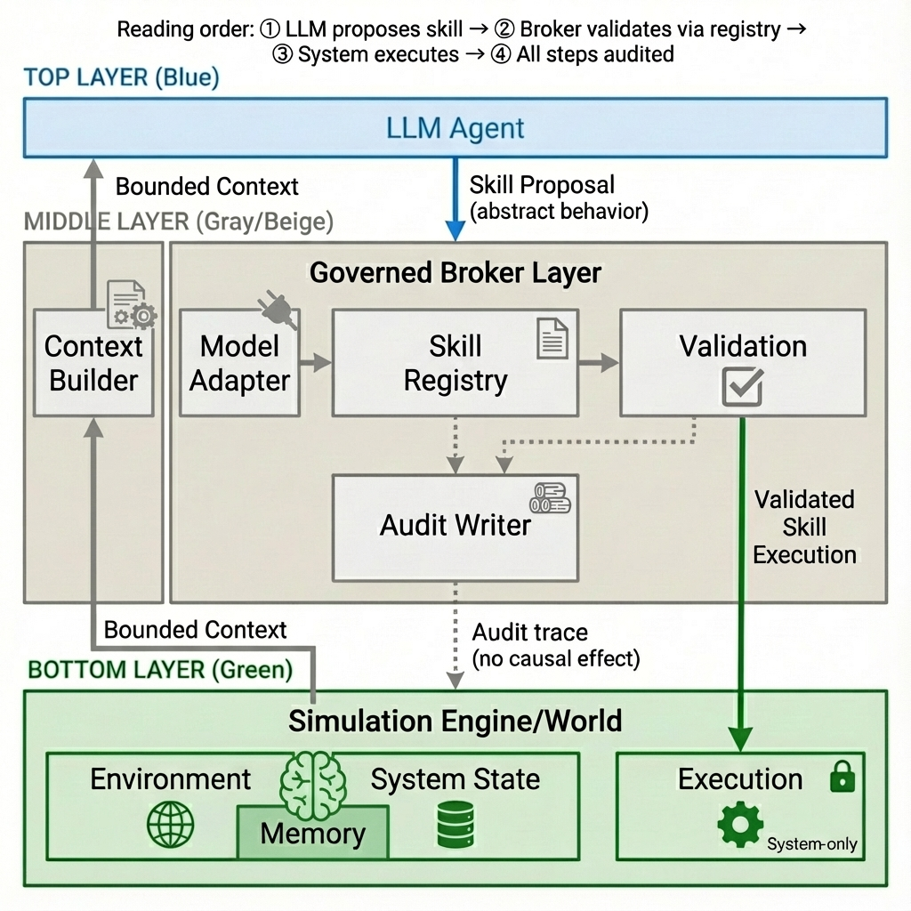

# Governed Broker Framework

**[English](#english) | [中文](#中文)**

---

## English

**A governance middleware for LLM-driven Agent-Based Models (ABMs)**

### ✨ What's New in v0.2 - Skill-Governed Architecture

| v0.1 Action-Based | v0.2 Skill-Governed |
|-------------------|---------------------|
| LLM outputs `action_code: "1"` | LLM outputs `skill_name: "buy_insurance"` |
| Format + PMT validation | 5-stage validation pipeline |
| Single LLM parser | Multi-LLM adapters (Ollama, OpenAI) |
| Implicit MCP role | MCP = execution substrate only |

👉 **See [`docs/skill_architecture.md`](docs/skill_architecture.md) for detailed architecture comparison.**

---

### Quick Start

```bash
# Install
pip install -e .

# Run with Skill-Governed API (v0.2)
cd examples/flood_adaptation
python run.py --model llama3.2:3b --num-agents 100 --num-years 10
```

---

### Architecture



#### Three-Layer Design (Preserved)

| Layer | Responsibility | Key Rule |
|-------|---------------|----------|
| **LLM Agent** | Propose skills from bounded context | READ-ONLY access |
| **Governed Broker** | Validate via SkillRegistry, retry, audit | NO STATE MUTATION |
| **Simulation Engine** | Execute approved skills, update state | SYSTEM-ONLY |

#### Skill-Governed Flow

```
① LLM proposes skill → ② ModelAdapter parses → ③ SkillRegistry validates
→ ④ 5-stage validation → ⑤ ApprovedSkill → ⑥ System executes
→ ⑦ All steps audited
```

---

### Key Components

| Component | Location | Purpose |
|-----------|----------|---------|
| `SkillProposal` | `broker/skill_types.py` | LLM output schema |
| `SkillRegistry` | `broker/skill_registry.py` | Institutional rules |
| `ModelAdapter` | `broker/model_adapter.py` | Multi-LLM support |
| `SkillBrokerEngine` | `broker/skill_broker_engine.py` | Main orchestrator |
| `SkillValidators` | `validators/skill_validators.py` | 5-stage validation |

---

### Validation Pipeline

| Validator | Checks |
|-----------|--------|
| **SkillAdmissibility** | Skill exists? Agent eligible? |
| **ContextFeasibility** | Preconditions met? |
| **InstitutionalConstraint** | Once-only? Annual limit? |
| **EffectSafety** | Safe state changes? |
| **PMTConsistency** | Reasoning consistent? |

---

### MCP Role

| MCP Does ✅ | MCP Does NOT ❌ |
|-------------|----------------|
| Execution | Decision making |
| Sandbox | Expose to LLM |
| Logging | Governance |

> MCP = **Execution Substrate**, not a governance unit.

---

### License

MIT

---

## 中文

**LLM 驅動 Agent-Based Model (ABM) 的治理中介層**

### ✨ v0.2 新功能 - 技能治理架構

| v0.1 動作導向 | v0.2 技能治理 |
|---------------|---------------|
| LLM 輸出 `action_code: "1"` | LLM 輸出 `skill_name: "buy_insurance"` |
| 格式 + PMT 驗證 | 5 階段驗證管線 |
| 單一 LLM 解析器 | 多 LLM 適配器 (Ollama, OpenAI) |
| 隱含的 MCP 角色 | MCP = 僅作為執行基底 |

👉 **詳見 [`docs/skill_architecture.md`](docs/skill_architecture.md)**

---

### 快速開始

```bash
# 安裝
pip install -e .

# 執行技能治理 API (v0.2)
cd examples/flood_adaptation
python run.py --model llama3.2:3b --num-agents 100 --num-years 10
```

---

### 架構


#### 三層設計（保留）

| 層級 | 職責 | 核心規則 |
|------|------|----------|
| **LLM Agent** | 從有界脈絡提出技能 | 唯讀存取 |
| **Governed Broker** | 透過 SkillRegistry 驗證、重試、審計 | 不可變更狀態 |
| **Simulation Engine** | 執行已核准技能、更新狀態 | 僅系統可執行 |

#### 技能治理流程

```
① LLM 提出技能 → ② ModelAdapter 解析 → ③ SkillRegistry 驗證
→ ④ 5 階段驗證 → ⑤ ApprovedSkill → ⑥ 系統執行
→ ⑦ 所有步驟皆審計
```

---

### 核心元件

| 元件 | 位置 | 用途 |
|------|------|------|
| `SkillProposal` | `broker/skill_types.py` | LLM 輸出格式 |
| `SkillRegistry` | `broker/skill_registry.py` | 制度規則 |
| `ModelAdapter` | `broker/model_adapter.py` | 多 LLM 支援 |
| `SkillBrokerEngine` | `broker/skill_broker_engine.py` | 主協調器 |
| `SkillValidators` | `validators/skill_validators.py` | 5 階段驗證 |

---

### 驗證管線

| 驗證器 | 檢查項目 |
|--------|----------|
| **SkillAdmissibility** | 技能存在？代理有權限？ |
| **ContextFeasibility** | 前置條件滿足？ |
| **InstitutionalConstraint** | 單次限制？年度限制？ |
| **EffectSafety** | 狀態變更安全？ |
| **PMTConsistency** | 推理一致？ |

---

### MCP 角色

| MCP 負責 ✅ | MCP 不負責 ❌ |
|-------------|---------------|
| 執行 | 決策 |
| 沙盒 | 暴露給 LLM |
| 日誌 | 治理 |

> MCP = **執行基底**，而非治理單位。

---

### 授權

MIT
