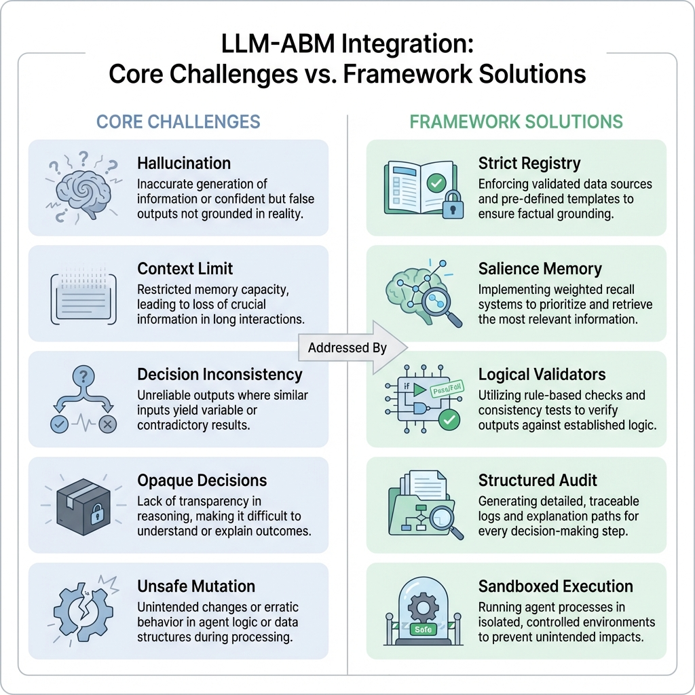
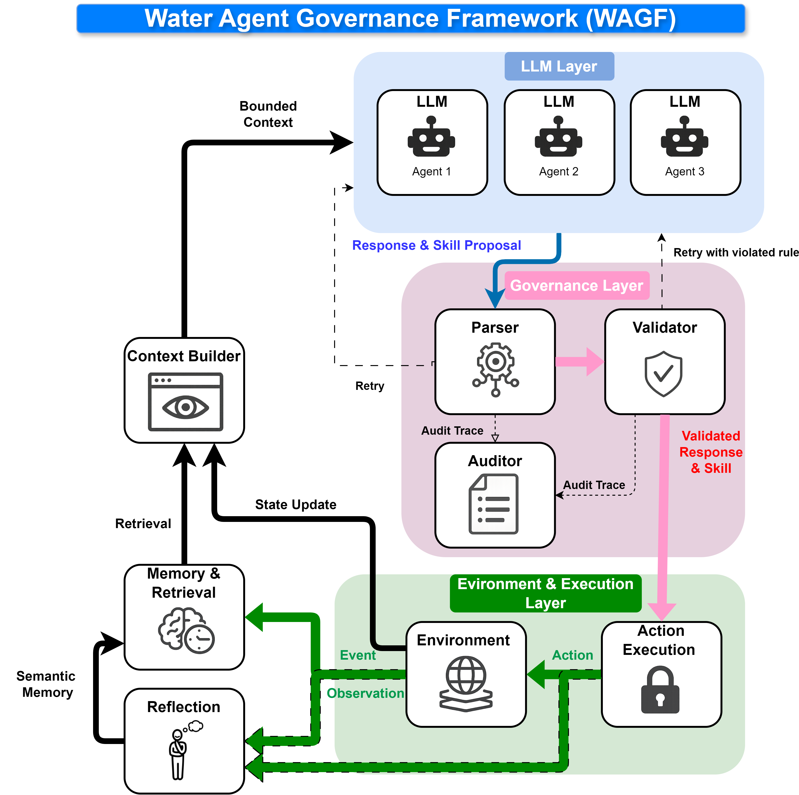

# Water Agent Governance Framework (WAGF)

<div align="center">

**A governance framework for LLM-driven agent-based models in human-water systems**

*Water-sector-first governance core with reusable extension patterns*

[](https://www.python.org/downloads/)
[](LICENSE)
[](https://ollama.com/)

[**English**](README.md) | [**Chinese**](README_zh.md)

</div>

## What is WAGF?

Large Language Models (LLMs) can generate rich, human-like reasoning for agent-based models, but they also hallucinate, contradict themselves, and produce invalid actions. WAGF provides a **Governance Broker** that validates every LLM decision against physical constraints and behavioral theories before execution, turning unreliable LLM outputs into scientifically auditable agent behavior for human-water systems.

**Key contribution**: Unlike prompt-only approaches, WAGF structurally prevents hallucinations through a validation pipeline that checks each decision against domain rules. Invalid decisions trigger a retry loop with specific feedback, not just re-prompting.



| Challenge | Framework Solution |
|:---|:---|
| **Hallucination** - LLM invents actions | Strict skill registry: only registered actions accepted |
| **Logical drift** - reasoning contradicts choice | Thinking validators enforce construct-action coherence |
| **Context overflow** - cannot dump full history | Salience-based memory retrieval (top-k relevant events) |
| **Opaque decisions** - no audit trail | Structured CSV traces: input, reasoning, validation, outcome |
| **Unsafe mutation** - LLM breaks simulation state | Sandboxed execution: validated skills run by engine, not LLM |

### Reference Domain Packs and Case Studies

The repository currently ships with mature water-sector reference implementations. They define the main identity of the framework. The same broker, validator, memory, and context infrastructure can be extended to other ABM settings later, but water remains the home domain.

- **Flood Household Adaptation** - Single-agent using Protection Motivation Theory (PMT), 13-year simulation with Gemma 3 (4B/12B/27B local LLMs), Passaic River Basin
- **Flood Multi-Agent** - 402 agents (200 owner + 200 renter + 1 government + 1 insurance), 13-year simulation, Passaic River Basin
- **Irrigation Water Management** - 78 CRSS agents, 42-year simulation, Colorado River Basin

---

## Quick Start

### Prerequisites

- Python 3.10+
- [Ollama](https://ollama.com/download) for local LLM inference (optional; mock mode available)

```bash
# 1. Clone and install
git clone https://github.com/WenyuChiou/governed-broker-framework.git
cd governed_broker_framework
pip install -e ".[llm]"              # core + LLM providers

# 2. Try the mock demo (no Ollama needed)
python examples/quickstart/01_barebone.py      # basic governance loop
python examples/quickstart/02_governance.py    # see rules blocking invalid actions

# 3. Run with a real LLM (requires Ollama)
ollama pull gemma3:4b                          # download ~2.5 GB model
python examples/governed_flood/run_experiment.py --model gemma3:4b --years 3 --agents 10

# 4. Full comparison study: no governance vs governance vs governance+memory
python examples/single_agent/run_flood.py --model gemma3:4b --years 10 --agents 100 \
    --memory-engine humancentric --governance-mode strict
```

**Cloud LLM providers** (no local GPU needed):

```bash
--model anthropic:claude-sonnet-4-5  # requires ANTHROPIC_API_KEY
--model openai:gpt-4o                # requires OPENAI_API_KEY
--model gemini:gemini-1.5-flash      # requires GOOGLE_API_KEY
```

### Governed Decision Example

Here is what WAGF does at every time step: a concrete trace from the flood simulation:

```text
Year 3, Agent #42 (low-income homeowner, high flood zone):

  LLM proposes: elevate_home (cost $30,000)
    Physical validator:  PASS  (not already elevated)
    Thinking validator:  ERROR - threat_appraisal=Medium but chose most expensive action
    Retry with feedback: "Your threat assessment is Medium, but you chose the
      costliest protective action. Consider whether a less expensive option
      (e.g., insurance at $1,200/yr) better matches your risk assessment."

  LLM proposes (retry 1): buy_insurance (cost $1,200/yr)
    Physical validator:  PASS
    Thinking validator:  PASS  (Medium threat -> moderate action: coherent)
    Personal validator:  PASS  (income $35,000 > premium $1,200)
    Social validator:    WARNING - 70% of neighbors did nothing (logged, not blocked)
    Semantic validator:  PASS
    APPROVED - Executed by simulation engine

  Audit CSV row:
    year=3, agent=42, proposed=elevate_home, outcome=REJECTED, retry=1,
    final=buy_insurance, outcome=APPROVED, rule_violated=thinking_pmt_coherence
```

This trace is fully reproducible and auditable: every decision, rejection, and retry is logged.

---

## Architecture



WAGF has two core components:

```text
Governance Broker
  Validates LLM outputs against domain rules before execution
  Flow: Context -> LLM -> Parse -> Validate -> Approve -> Execute
  If validation returns ERROR, the broker retries with targeted feedback
  Validator categories: Physical | Thinking | Personal | Social | Semantic

Execution Environment
  Runs simulations, manages state, and handles agent lifecycle
  Lifecycle hooks: pre_year() -> agent decisions -> post_step()
                   post_year() -> next year
  Each domain provides: skill_registry.yaml + agent_types.yaml
                        + lifecycle_hooks.py

Supporting subsystems
  Memory     - weighted retrieval (recency + importance + context), consolidation, decay
  Context    - tiered prompt construction (core / historic / recent)
  Social     - neighbor observation, information diffusion (multi-agent)
  Reflection - periodic LLM-driven memory consolidation
```

**Governance Broker** (`broker/`) - The 6-stage pipeline runs on every agent decision. Five validator categories check physical constraints, logical coherence, financial capacity, social norms, and semantic grounding. ERROR results trigger retry with specific feedback; WARNING results log observations without blocking.

**Execution Environment** - Domain-specific simulation engines, lifecycle hooks (`pre_year` / `post_step` / `post_year`), event generators, and state management. Each domain (flood, irrigation) provides its own hooks and skill definitions in YAML.

### Core vs Domain Packs

WAGF is easiest to read as three layers:

- **Core framework** (`broker/`) - reusable governance pipeline, parsing, validation orchestration, memory, context assembly, and audit
- **Domain packs** (`broker/domains/`, experiment config, lifecycle hooks) - theory metadata, domain validators, construct naming, skill registries
- **Reference experiments** (`examples/`) - complete runnable ABM studies built from the core plus a domain pack

The current flood and irrigation implementations are the primary reference packs because WAGF was designed for water-sector ABM first. Extension beyond water is possible, but it is a secondary path rather than the central claim.

### Repo Surface

For continuation work and external onboarding, treat the repository as four surfaces:

- **Framework-facing**: `broker/`, `providers/`, `tests/`, `docs/guides/`, `docs/modules/`
- **Reference-domain-facing**: `examples/minimal/`, `examples/minimal_nonwater/`, `examples/single_agent/`, `examples/irrigation_abm/`, `examples/multi_agent/flood/`
- **Paper/manuscript-facing**: `paper/`
- **Local or archive**: `.ai/`, `_archive/`, `examples/archive/`, other ignored working directories

This boundary keeps the framework story separate from manuscript production and local analysis clutter.

### Combinatorial Agent Design

Build agents of varying cognitive complexity by stacking modules:

| Level | Component | Effect |
|:---|:---|:---|
| **Base** | Execution Engine | Can execute actions, no memory or rationality |
| **+ Level 1** | Context + Window Memory | Bounded perception of recent events |
| **+ Level 2** | Weighted Memory | Emotional encoding, weighted retrieval, consolidation, decay |
| **+ Level 3** | Governance Broker | Rule enforcement: decisions must match beliefs |

This enables controlled comparison studies: run Level 1 (no governance) vs Level 3 (full governance) to isolate which component resolves a specific behavioral bias.

### Key Entry Points

```text
broker/core/skill_broker_engine.py        - The 6-stage governance pipeline
broker/core/experiment.py                 - ExperimentRunner + ExperimentBuilder API
broker/validators/governance/             - All 5 validator category implementations
broker/components/memory/                 - Memory engine ABC + 4 implementations
broker/components/context/providers.py    - Context enrichment chain
examples/quickstart/                      - Progressive tutorial
```

---

---

## Configuration & Extension

In practice, reusable core behavior belongs in `broker/`, while domain packs carry any theory metadata or Python validators that cannot be expressed cleanly in YAML alone.

All domain-specific values are loaded from YAML - zero hardcoded domain logic in `broker/`.

| What You Want to Change | YAML Only | Python Required |
|:---|:---:|:---:|
| Add/remove skills (actions) | Yes | No |
| Define agent types & personas | Yes | No |
| Add/modify governance rules | Yes | No |
| Tune memory parameters | Yes | No |
| Change LLM model or provider | Yes | No |
| Add a new domain validator | No | Yes |
| Add a new memory engine | No | Yes |
| Add a new LLM provider | No | Yes |
| Add a new domain (flood, irrigation, ...) | No | Yes |

**To add a new domain**, provide three files:
1. `skill_registry.yaml` - available actions and their preconditions
2. `agent_types.yaml` - persona definitions, construct labels, governance rules
3. `lifecycle_hooks.py` - subclass `BaseLifecycleHooks` for environment setup and state transitions

See [Customization Guide](docs/guides/customization_guide.md), [Experiment Design Guide](docs/guides/experiment_design_guide.md), and [Domain Pack Guide](docs/guides/domain_pack_guide.md).

### Programmatic API

For external users, the "new domain" workflow is best understood as building a **domain pack**: reusable configuration plus any theory metadata, validators, and lifecycle hooks needed for one ABM setting.

```python
from broker.core.experiment import ExperimentBuilder
from broker.components.memory.engines.humancentric import HumanCentricMemoryEngine

runner = (
    ExperimentBuilder()
    .with_model("gemma3:4b")          # or "anthropic:claude-sonnet-4-5"
    .with_years(3)
    .with_agents(agents)              # list of agent dicts from profiles
    .with_simulation(sim_engine)      # your domain SimulationEngine
    .with_skill_registry("config/skill_registry.yaml")
    .with_governance("strict", "config/agent_types.yaml")
    .with_memory_engine(HumanCentricMemoryEngine(ranking_mode="weighted"))
    .with_seed(42)
    .build()
)
runner.run()
```

---

## Examples

Start with these five surfaces:

| Surface | Description | Link |
|:---|:---|:---|
| **Quickstart** | Progressive tutorial for the broker loop | [Go](examples/quickstart/) |
| **Minimal Template** | Official scaffold for a new ABM domain | [Go](examples/minimal/) |
| **Single-Agent Flood** | Primary single-agent flood reference implementation | [Go](examples/single_agent/) |
| **Irrigation ABM** | Primary single-agent irrigation reference implementation | [Go](examples/irrigation_abm/) |
| **Multi-Agent Flood** | Primary multi-agent flood reference implementation | [Go](examples/multi_agent/flood/) |

Secondary examples such as `governed_flood/`, `multi_agent_simple/`, and
`minimal_nonwater/` remain useful, but they are teaching/demo surfaces rather
than the main reference implementations. See [examples/README.md](examples/README.md)
for the full map.

---

## Documentation

**Getting Started**: [Quickstart Guide](docs/guides/quickstart_guide.md) | [Experiment Design](docs/guides/experiment_design_guide.md) | [Domain Packs](docs/guides/domain_pack_guide.md) | [Troubleshooting](docs/guides/troubleshooting_guide.md)

**Guides**: [Agent Assembly](docs/guides/agent_assembly.md) | [Customization](docs/guides/customization_guide.md) | [Multi-Agent Setup](docs/guides/multi_agent_setup_guide.md) | [Advanced Patterns](docs/guides/advanced_patterns.md) | [YAML Reference](docs/references/yaml_configuration_reference.md)

**Architecture**: [System Overview](docs/architecture/architecture.md) | [Skill Pipeline](docs/architecture/skill_architecture.md) | [Governance Core](docs/modules/governance_core.md) | [Memory System](docs/modules/memory_components.md)

**Theory**: [Theoretical Basis](docs/modules/00_theoretical_basis_overview.md) | [Skill Registry](docs/modules/skill_registry.md)

### Navigation

| I am a... | Start here |
|:---|:---|
| **Water researcher** wanting to try it | [Quickstart](docs/guides/quickstart_guide.md) -> [Run Examples](examples/README.md) -> [Experiment Design](docs/guides/experiment_design_guide.md) |
| **Researcher** reproducing paper results | [Theory](docs/modules/00_theoretical_basis_overview.md) -> [Experiment Design](docs/guides/experiment_design_guide.md) -> [Examples](examples/README.md) |
| **Developer** extending the framework | [Architecture](docs/architecture/architecture.md) -> [Customization](docs/guides/customization_guide.md) -> [Agent Types](docs/guides/agent_type_specification_guide.md) |

---

## How to Cite

If you use WAGF in your research, please cite:

```bibtex
@article{wagf2026,
  title={Water Agent Governance Framework: Governing LLM-Driven Agent-Based Models for Water Resources},
  author={Chiou, Wenyu and Yang, Y. C. Ethan},
  year={2026},
  note={Manuscript in preparation}
}
```

## References

1. Rogers, R. W. (1983). Cognitive and physiological processes in fear appeals and attitude change: A revised theory of protection motivation. _Social Psychophysiology_.
2. Grimm, V., et al. (2005). Pattern-oriented modeling of agent-based complex systems. _Science_, 310(5750), 987-991.
3. Park, J. S., et al. (2023). Generative Agents: Interactive Simulacra of Human Behavior. _ACM CHI_.
4. Hung, C.-L. J., & Yang, Y. C. E. (2021). Assessing adaptive irrigation impacts on water scarcity in nonstationary environments. _Water Resources Research_, 57(7).
5. Bubeck, P., Botzen, W. J. W., & Aerts, J. C. J. H. (2012). A review of risk perceptions and other factors that influence flood mitigation behavior. _Risk Analysis_, 32(9), 1481-1495.
6. Oreskes, N., Shrader-Frechette, K., & Belitz, K. (1994). Verification, validation, and confirmation of numerical models in the earth sciences. _Science_, 263(5147), 641-646.

---

## License

MIT
