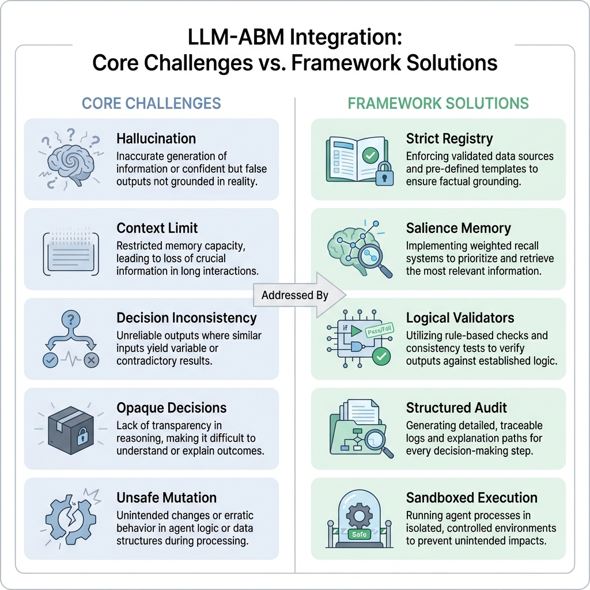
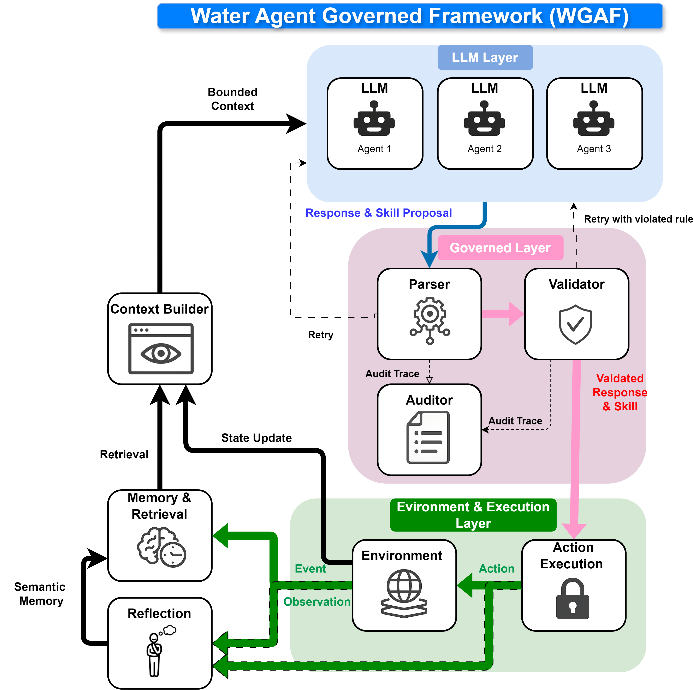

# Water Agent Governance Framework (WAGF)

<div align="center">

**LLM 驅動代理人模型的治理框架，應用於水資源領域**

*領域無關的治理核心，以洪水風險適應與灌溉水管理為驗證案例*

[](https://www.python.org/downloads/)
[](LICENSE)
[]()
[](https://ollama.com/)

[**English**](README.md) | [**繁體中文**](README_zh.md)

</div>

## WAGF 是什麼？

大型語言模型 (LLM) 能為代理人模型生成豐富、類人的推理——但也會產生幻覺、自我矛盾、以及無效的動作。WAGF 提供了一個**治理仲裁器 (Governance Broker)**，在每個 LLM 決策執行前，依據物理約束和行為理論進行驗證，將不可靠的 LLM 輸出轉化為科學上可審計的代理人行為。

**核心貢獻**：不同於僅靠 prompt 的方法，WAGF 透過驗證管線從結構上防止幻覺——每個決策都會經過領域規則檢查。無效決策觸發附帶具體反饋的重試迴路，而非單純的重新提示。



| 挑戰 | 框架解決方案 |
|:---|:---|
| **幻覺** — LLM 捏造動作 | 嚴格技能註冊表：僅接受已註冊的動作 |
| **邏輯漂移** — 推理與選擇矛盾 | 思考驗證器強制構念-行動一致性 |
| **上下文溢出** — 無法塞入完整歷史 | 基於顯著性的記憶檢索（top-k 相關事件） |
| **不透明決策** — 無審計軌跡 | 結構化 CSV 軌跡：輸入、推理、驗證、結果 |
| **不安全修改** — LLM 破壞模擬狀態 | 沙盒執行：驗證通過的技能由引擎執行，非 LLM |

### 已驗證案例研究

- **洪水家戶適應** — 100 個代理人使用保護動機理論 (PMT)，10 年模擬，Gemma 3（小型/中型/大型本地 LLM）
- **洪水多代理人** — 400 個代理人（家戶 + 政府 + 保險），13 年模擬，波多馬克河流域
- **灌溉水管理** — 78 個 CRSS 代理人，42 年模擬，科羅拉多河流域

---

## 快速上手

### 前置需求

- Python 3.10+
- [Ollama](https://ollama.com/download)（本地 LLM 推理，可選 — 有 mock 模式可用）

```bash
# 1. 克隆並安裝
git clone https://github.com/WenyuChiou/governed-broker-framework.git
cd governed_broker_framework
pip install -e ".[llm]"              # 核心 + LLM 提供者

# 2. 試試 mock 示範（不需要 Ollama）
python examples/quickstart/01_barebone.py      # 基本治理迴路
python examples/quickstart/02_governance.py    # 看規則如何阻止無效動作

# 3. 使用真實 LLM 執行（需要 Ollama）
ollama pull gemma3:4b                          # 下載約 2.5 GB 模型
python examples/governed_flood/run_experiment.py --model gemma3:4b --years 3 --agents 10

# 4. 完整比較研究：無治理 / 治理 / 治理+記憶
python examples/single_agent/run_flood.py --model gemma3:4b --years 10 --agents 100 \
    --memory-engine humancentric --governance-mode strict
```

**雲端 LLM 提供者**（不需要本地 GPU）：

```bash
--model anthropic:claude-sonnet-4-5  # 需要 ANTHROPIC_API_KEY
--model openai:gpt-4o                       # 需要 OPENAI_API_KEY
--model gemini:gemini-1.5-flash             # 需要 GOOGLE_API_KEY
```

### 治理決策範例

以下是 WAGF 在每個時間步的運作——來自洪水模擬的真實軌跡：

```
第 3 年，代理人 #42（低收入屋主，高洪水風險區）：

  LLM 提議：加高房屋 (elevate_home, 費用 $30,000)
    物理驗證器：  通過  （尚未加高）
    思考驗證器：  錯誤 — 威脅評估=中等，但選擇了最昂貴的保護動作
    → 附帶反饋重試：「您的威脅評估為中等，但您選擇了最昂貴的保護動作。
      請考慮較便宜的選項（例如保險 $1,200/年）是否更符合您的風險評估。」

  LLM 提議（重試 1）：購買保險 (buy_insurance, 費用 $1,200/年)
    物理驗證器：  通過
    思考驗證器：  通過  （中等威脅 → 適度動作：一致）
    個人驗證器：  通過  （收入 $35,000 > 保費 $1,200）
    社會驗證器：  警告 — 70% 的鄰居未採取行動（記錄，不阻止）
    語義驗證器：  通過
    → 核准 → 由模擬引擎執行

  審計 CSV 行：
    year=3, agent=42, proposed=elevate_home, outcome=REJECTED, retry=1,
    final=buy_insurance, outcome=APPROVED, rule_violated=thinking_pmt_coherence
```

此軌跡完全可重現且可審計——每個決策、拒絕和重試都被記錄。

---

## 架構



WAGF 有兩個核心組件：

```
┌──────────────────────────────────────────────────────────────────┐
│                       治理仲裁器 (Governance Broker)              │
│  在執行前驗證 LLM 輸出是否符合領域規則                            │
│                                                                  │
│  上下文 → LLM → 解析 → 驗證 → 核准 → 執行                       │
│           ↑              │                                       │
│           └── 附帶反饋 ──┘ （若 ERROR）                          │
│               重試                                               │
│                                                                  │
│  驗證器類別：物理 | 思考 | 個人 | 社會 | 語義                     │
├──────────────────────────────────────────────────────────────────┤
│                    執行環境 (Execution Environment)               │
│  執行模擬、管理狀態、處理代理人生命週期                           │
│                                                                  │
│  生命週期鉤子：pre_year() → 代理人決策 → post_step()             │
│                → post_year() → 下一年                            │
│                                                                  │
│  每個領域提供：skill_registry.yaml + agent_types.yaml             │
│                + lifecycle_hooks.py                                │
└──────────────────────────────────────────────────────────────────┘

支援子系統（按實驗配置）：
  記憶    — 情緒顯著性編碼、整合、衰減
  上下文  — 分層提示詞建構（核心 / 歷史 / 近期）
  社會    — 鄰居觀察、資訊擴散（多代理人）
  反思    — 定期 LLM 驅動的記憶整合
```

**治理仲裁器** (`broker/`) — 6 階段管線在每個代理人決策時運行。五類驗證器檢查物理約束、邏輯一致性、財務能力、社會規範及語義落地。ERROR 結果觸發附帶具體反饋的重試；WARNING 結果記錄觀察但不阻止。

**執行環境** — 領域特定的模擬引擎、生命週期鉤子（`pre_year` / `post_step` / `post_year`）、事件產生器及狀態管理。每個領域（洪水、灌溉）提供自己的鉤子和技能定義（YAML）。

### 組合式代理人設計

透過堆疊模組，建構不同認知複雜度的代理人：

| 層級 | 組件 | 效果 |
|:---|:---|:---|
| **底座** | 執行引擎 | 可執行動作，無記憶或理性 |
| **+ Level 1** | 上下文 + 視窗記憶 | 對近期事件的有限感知 |
| **+ Level 2** | 顯著性記憶 | 情緒編碼、整合、衰減 |
| **+ Level 3** | 治理仲裁器 | 規則強制執行：決策必須匹配信念 |

這支持受控比較研究：運行 Level 1（無治理）對比 Level 3（完整治理），以隔離哪個組件解決了特定的行為偏差。

### 關鍵入口檔案

```
broker/core/skill_broker_engine.py        — 6 階段治理管線
broker/core/experiment.py                 — ExperimentRunner + ExperimentBuilder API
broker/validators/governance/             — 5 類驗證器實作
broker/components/memory/                 — 記憶引擎 ABC + 4 種實作
broker/components/context/providers.py    — 上下文充實鏈
examples/quickstart/                      — 漸進式教學
```

---

## 校準與驗證 (C&V)

事後驗證分三層，遵循 Grimm et al. (2005) 模式導向建模：

| 層級 | 範圍 | 核心指標 | 測試目標 |
|:---|:---|:---|:---|
| **L1 微觀** | 個體代理人 | **CACR**（構念-行動一致率）、**R_H**（幻覺率）、**EBE**（基於事件的評估） | 個體決策是否與報告的心理構念一致？ |
| **L2 宏觀** | 總體 | **EPI**（經驗合理性指數）— 與經驗基準的加權匹配 | 總體採用率是否符合真實數據（如 NFIP 保險率、USGS 用水量）？ |
| **L3 認知** | 心理計量 | **ICC**（組內相關係數）、**eta-squared**（效果量） | LLM 是否在重複測試中產生可靠、可區分的構念評分？ |

L1/L2 零 LLM 調用——純粹基於審計 CSV 軌跡運作。詳見 [C&V 框架文件](broker/validators/calibration/README.md)。

---

## 配置與擴展

所有領域特定值均從 YAML 載入——`broker/` 中零硬編碼領域邏輯。

| 您想變更的內容 | 僅 YAML | 需要 Python |
|:---|:---:|:---:|
| 新增/移除技能（動作） | 是 | — |
| 定義代理人類型與人設 | 是 | — |
| 新增/修改治理規則 | 是 | — |
| 調整記憶參數 | 是 | — |
| 變更 LLM 模型或提供者 | 是 | — |
| 新增領域驗證器 | — | 是 |
| 新增記憶引擎 | — | 是 |
| 新增 LLM 提供者 | — | 是 |
| 新增領域（洪水、灌溉...） | — | 是 |

**新增領域**需提供三個檔案：
1. `skill_registry.yaml` — 可用動作及其前置條件
2. `agent_types.yaml` — 人設定義、構念標籤、治理規則
3. `lifecycle_hooks.py` — 繼承 `BaseLifecycleHooks` 處理環境設定與狀態轉換

詳見 [自定義指南](docs/guides/customization_guide.md) 與 [實驗設計指南](docs/guides/experiment_design_guide.md)。

### 程式化 API

```python
from broker.core.experiment import ExperimentBuilder
from broker.components.memory.engines.humancentric import HumanCentricMemoryEngine

runner = (
    ExperimentBuilder()
    .with_model("gemma3:4b")          # 或 "anthropic:claude-sonnet-4-5"
    .with_years(3)
    .with_agents(agents)               # 來自 profiles 的代理人 dict 列表
    .with_simulation(sim_engine)       # 你的領域 SimulationEngine
    .with_skill_registry("config/skill_registry.yaml")
    .with_governance("strict", "config/agent_types.yaml")
    .with_memory_engine(HumanCentricMemoryEngine())
    .with_seed(42)
    .build()
)
runner.run()
```

---

## 範例

| 範例 | 說明 | 連結 |
|:---|:---|:---|
| **快速上手** | 漸進式教學（mock LLM → 治理規則） | [前往](examples/quickstart/) |
| **最小範本** | 複製此目錄即可開始新領域（3 代理人，5 年） | [前往](examples/minimal/) |
| **治理洪水** | 含完整治理的獨立示範 | [前往](examples/governed_flood/) |
| **單代理人基準** | 比較研究：無治理 / 治理 / 治理+記憶 | [前往](examples/single_agent/) |
| **灌溉 ABM** | 科羅拉多河流域水需求 (Hung & Yang 2021) | [前往](examples/irrigation_abm/) |
| **多代理人洪水** | 400 個代理人含政府與保險機構代理人 | [前往](examples/multi_agent/flood/) |

---

## 文件

**入門**: [快速上手指南](docs/guides/quickstart_guide.md) | [實驗設計](docs/guides/experiment_design_guide.md) | [疑難排解](docs/guides/troubleshooting_guide.md)

**指南**: [代理人組裝](docs/guides/agent_assembly_zh.md) | [自定義](docs/guides/customization_guide.md) | [多代理人設定](docs/guides/multi_agent_setup_guide.md) | [進階模式](docs/guides/advanced_patterns.md) | [YAML 參考](docs/references/yaml_configuration_reference.md)

**架構**: [系統總覽](docs/architecture/architecture.md) | [技能管線](docs/architecture/skill_architecture.md) | [治理核心](docs/modules/governance_core_zh.md) | [記憶系統](docs/modules/memory_components_zh.md) | [C&V 框架](broker/validators/calibration/README.md)

**理論**: [理論基礎](docs/modules/00_theoretical_basis_overview_zh.md) | [技能註冊表](docs/modules/skill_registry_zh.md)

### 導覽

| 讀者類型 | 建議路徑 |
|:---|:---|
| **水資源研究者**（想試用） | [快速上手](docs/guides/quickstart_guide.md) → [執行範例](examples/README.md) → [實驗設計](docs/guides/experiment_design_guide.md) |
| **研究者**（重現論文結果） | [理論](docs/modules/00_theoretical_basis_overview_zh.md) → [實驗設計](docs/guides/experiment_design_guide.md) → [C&V 框架](broker/validators/calibration/README.md) |
| **開發者**（擴展框架） | [架構](docs/architecture/architecture.md) → [自定義](docs/guides/customization_guide.md) → [代理人類型](docs/guides/agent_type_specification_guide.md) |

---

## 引用方式

如果您在研究中使用 WAGF，請引用：

```bibtex
@article{wagf2026,
  title={Water Agent Governance Framework: Governing LLM-Driven Agent-Based Models for Water Resources},
  author={Chen, Wen-Yuan and Yang, Y. C. Ethan},
  year={2026},
  note={Manuscript in preparation}
}
```

## 參考文獻

1. Rogers, R. W. (1983). Cognitive and physiological processes in fear appeals and attitude change: A revised theory of protection motivation. _Social Psychophysiology_.
2. Grimm, V., et al. (2005). Pattern-oriented modeling of agent-based complex systems. _Science_, 310(5750), 987-991.
3. Park, J. S., et al. (2023). Generative Agents: Interactive Simulacra of Human Behavior. _ACM CHI_.
4. Hung, C.-L. J., & Yang, Y. C. E. (2021). Assessing adaptive irrigation impacts on water scarcity in nonstationary environments. _Water Resources Research_, 57(7).
5. Bubeck, P., Botzen, W. J. W., & Aerts, J. C. J. H. (2012). A review of risk perceptions and other factors that influence flood mitigation behavior. _Risk Analysis_, 32(9), 1481-1495.

---

## 授權

MIT
