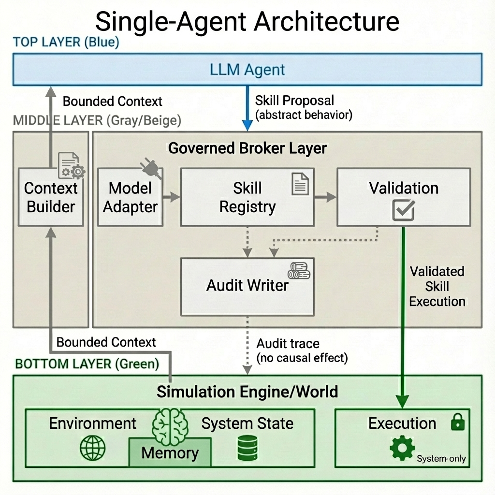
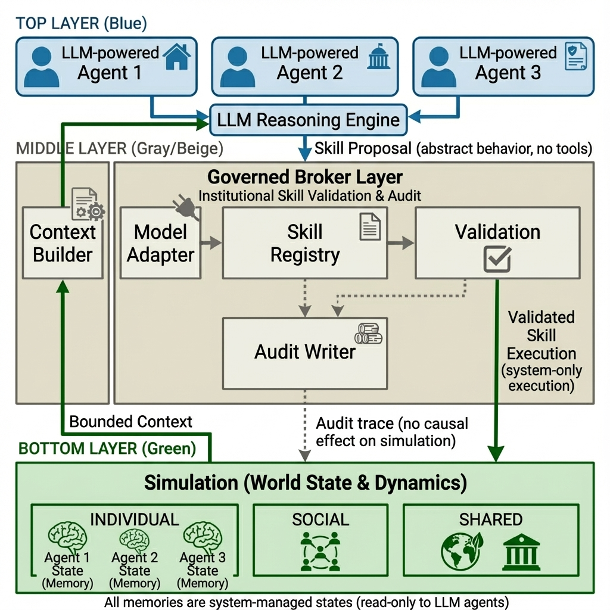
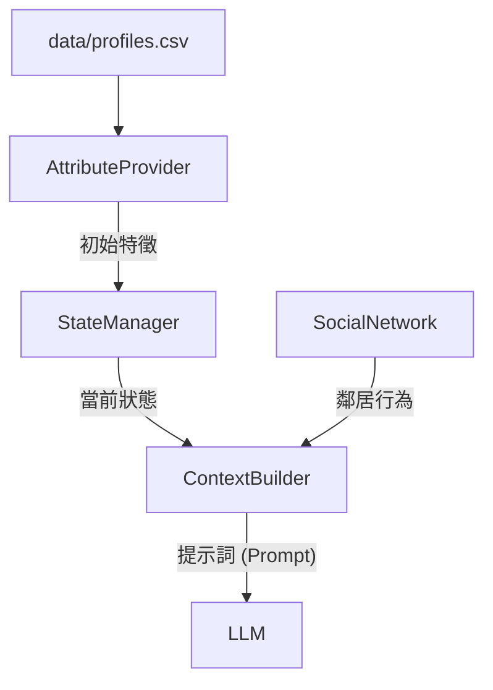

# Governed Broker Framework

**🌐 Language / 語言: [English](README.md) | [中文](README_zh.md)**

<div align="center">

**LLM 驅動的 Agent-Based Model 治理中間件**

[](https://www.python.org/downloads/)
[](LICENSE)

</div>

## 模組化中間件架構 (Modular Middleware Architecture)

本框架設計為位於代理人決策模型 (LLM) 與模擬環境 (ABM) 之間的 **治理中間件 (Governance Middleware)**。每個組件都是解耦的，允許靈活地實驗不同的模型、驗證規則與環境動態。

### 4 大核心模組

| 模組 | 角色 | 說明 |
| :--- | :--- | :--- |
| **Skill Registry** | *憲法* | 定義代理人 *能做什麼* (技能)，包含成本、限制與物理後果。 |
| **Skill Broker** | *法官* | 核心治理引擎。強制執行制度與心理一致性規則 ( PMT Coherence) 於 LLM 提案之上。 |
| **Sim Engine** | *世界* | 執行獲准的動作並管理物理狀態的演變 (例如：洪水損害)。 |
| **Context Builder** | *感官* | 為代理人合成一個有界的現實視圖 (個人記憶、社交信號、全局狀態)。 |

---

---

## 🛡️ 核心問題陳述


| 挑戰 | 問題描述 | 框架解決方案 | 組件 |
| :--- | :--- | :--- | :--- |
| **幻覺 (Hallucination)** | LLM 產生無效動作 (例如 "造牆") | **嚴格註冊表**: 僅接受已註冊的 `skill_id`。 | `SkillRegistry` |
| **上下文限制** | 無法將完整歷史塞入提示詞。 | **顯著性記憶**: 僅檢索 Top-k 相關的過去事件。 | `MemoryEngine` |
| **不一致性** | 決策與推理矛盾 (邏輯漂移)。 | **思考驗證器**: 檢查 `TP`/`CP` 與 `Choice` 之間的邏輯連貫性。 | `SkillBrokerEngine` |
| **不透明決策** | "為什麼代理人 X 做了 Y?" 行為佚失。 | **結構化軌跡**: 完整記錄 輸入、推理、驗證 與 結果。 | `AuditWriter` |
| **不安全變更** | LLM 輸出破壞模擬狀態。 | **沙盒執行**: 獲准技能由引擎執行，而非 LLM 直接修改。 | `SimulationEngine` |

---

## 架構

### 1. 單代理人迴圈 (Single-Agent Loop)

此圖說明單個代理人步驟的流程，強調從原始數據到已驗證技能的轉換。



> **進階版 (V4)**: 更詳細的版本請參見 [single_agent_architecture_v4.png](docs/single_agent_architecture_v4.png)

### 2. 多代理人互動 (Multi-Agent Interaction)

在多代理人模式下，社交信號成為關鍵輸入。



### 框架演進


**遷移說明**: 
- **v1 (舊版)**: 單體腳本。
- **v2 (當前)**: 模組化 `SkillBrokerEngine` + `providers`。請使用 `examples/single_agent/run_modular_experiment.py`。
本框架現在包含一個明確的 **Memory Layer (記憶層)**，位於 Governed Broker 和 Simulation State 之間，增強了代理人的一致性與學習能力。

### 記憶元件
*   **Working Memory (工作記憶)**: 短期儲存當下上下文 (例如：最近鄰居的動作、今年的政策)。
*   **Episodic Memory (情節記憶)**: 長期儲存重要事件的歷史 (例如：過去的洪水災害、理賠紀錄、過去的決策)。

### 資訊流
1.  **主動檢索 (`retrieve()`)**: 
    - 在做出決策之前，**Context Builder** 呼叫 `retrieve()` 獲取相關記憶。
    - *範例*: "檢索過去 3 年的洪水災害和理賠成功率。"
    - 這些數據會被注入到發送給 LLM 的 **Bounded Context (有界上下文)** 中。

2.  **被動儲存 (`add_memory()`)**:
    - 當 **Executor** 執行已驗證的技能後，觸發 `add_memory()`。
    - 決策、結果以及任何驗證註記都會被儲存為新的記憶軌跡。
    - *範例*: "決策：加高房屋 (第 5 年)。結果：成功。"

### 增強型審計 (Audit)
**Audit Writer** 捕捉認知過程的完整軌跡：
*   **Input**: 提供了什麼上下文/記憶？
*   **Reasoning**: LLM 的內部推理是什麼？
*   **Validation**: 提案為何被接受或拒絕？
*   **Execution**: 實際發生了什麼狀態變更？

---

## 快速開始

```bash
# 安裝依賴
pip install -r requirements.txt

# 執行範例實驗
cd examples/skill_governed_flood
python run_experiment.py --model llama3.2:3b --num-agents 100 --num-years 10
```

---

## 🔄 框架演進


**No MCP → MCP v1 → Skill-Governed (v2)**：漸進式增加治理層級，實現可靠的 LLM-ABM 整合。

---

## 核心元件

#### 代理人類型配置 (`broker/agent_types.yaml`)

所有代理人設置都已外部化到 **統一的 YAML 配置** 中。這允許在不修改 Python 代碼的情況下更改代理人行為。

```yaml
household:
  # 此代理人類型的有效技能
  actions: 
    - id: buy_insurance
      aliases: ["Purchase Insurance"]
    - id: do_nothing
  
  # 透過 get_parameters() 訪問的領域專屬參數
  parameters:
    income_threshold: 40000
    damage_threshold: 0.1
    
  # 用於驗證的 PMT 理論構念
  constructs: [TP, CP, SP, SC, PA]
```

### 提供者層與適配器 (`providers/` & `broker/utils/`)

| 組件 | 檔案 | 說明 |
|-----------|------|-------------|
| **UnifiedAdapter** | `model_adapter.py` | 🧠 **智能解析**：處理特定模型的怪癖（例如 DeepSeek 的 `<think>` 標籤、Llama 的 JSON 格式）。 |
| **LLM Utils** | `llm_utils.py` | ⚡ **集中調用**：具備穩健錯誤處理與詳細程度控制 (Verbosity control)。 |
| **OllamaProvider** | `ollama.py` | 預設的本地提供者。 |

### 驗證器層 (`validators/`)

我們將治理規則分類為一個 2x2 的矩陣：

| 維度 | **嚴格 (阻止並重試)** | **啟發式 (警告並記錄)** |
| :--- | :--- | :--- |
| **物理 / 身份規則** | *不可能的動作* <br> (例：「已加高房屋卻再次加高」、「已搬遷卻還買保險」) | *可疑狀態* <br> (例：「富裕代理人卻選擇什麼都不做」) |
| **心理 / 思考規則** | *邏輯謬誤* <br> (例：「高威脅 + 低成本 $\rightarrow$ 選擇什麼都不做」) | *行為異常* <br> (例：「極度焦慮卻延遲行動」) |

**實作方式：**
- **身份規則 (Identity Rules)**：根據當前狀態（來自 `StateManager`）進行檢查。
- **思考規則 (Thinking Rules)**：檢查 LLM 推理內容的內部一致性（來自 `SkillProposal`）。

### 初始數據與上下文連結

| 組件 | 角色 | 說明 |
|-----------|------|-------------|
| **AttributeProvider** | *種子* | 從 CSV (`agent_initial_profiles.csv`) 載入潛在代理人屬性或隨機生成。 |
| **ContextBuilder** | *連結者* | 動態提取並整合： <br> 1. **靜態特徵** (來自 AttributeProvider) <br> 2. **動態狀態** (來自 StateManager) <br> 3. **社交信號** (來自 SocialNetwork) |



## 狀態管理

### 狀態所有權 (多代理人)

| 狀態類型 | 範例 | 範圍 | 讀取 | 寫入 |
|----------|------|------|------|------|
| **Individual** | `memory`, `elevated`, `has_insurance` | 代理人私有 | 僅自己 | 僅自己 |
| **Social** | `neighbor_actions`, `last_decisions` | 可觀察鄰居 | 鄰居 | 系統 |
| **Shared** | `flood_occurred`, `year` | 所有代理人 | 全部 | 系統 |
| **Institutional** | `subsidy_rate`, `policy_mode` | 所有代理人 | 全部 | 僅政府 |

> **重點**: `memory` 是 **Individual** - 每個代理人有自己的記憶，不共享。

---

## 驗證管線

| 階段 | 驗證器 | 檢查 |
|------|--------|------|
| 1 | Admissibility | 技能存在？代理人有資格使用此技能？ |
| 2 | Feasibility | 前置條件滿足？(例如，尚未加高) |
| 3 | Constraints | 一次性？年度限制？ |
| 4 | Effect Safety | 狀態變更有效？ |
| 5 | PMT Consistency | 推理與決策一致？ |
| 6 | Uncertainty | 回應有信心？ |

---

## 框架比較

| 維度 | 單代理人 | 多代理人 |
|------|----------|----------|
| 狀態 | 僅 Individual | Individual + Social + Shared + Institutional |
| 代理人類型 | 1 種 | N 種 (居民、政府、保險公司) |
| 可觀察 | 僅自己 | 自己 + 鄰居 + 社區統計 |
| 上下文 | 直接 | 透過 Context Builder + Social Module |
| 使用案例 | 基礎 ABM | 具社會動態的政策模擬 |

---

## 文件

- [架構詳情](docs/skill_architecture.md)
- [自訂指南](docs/customization_guide.md)
- [實驗設計](docs/experiment_design_guide.md)

---

## 授權

MIT
