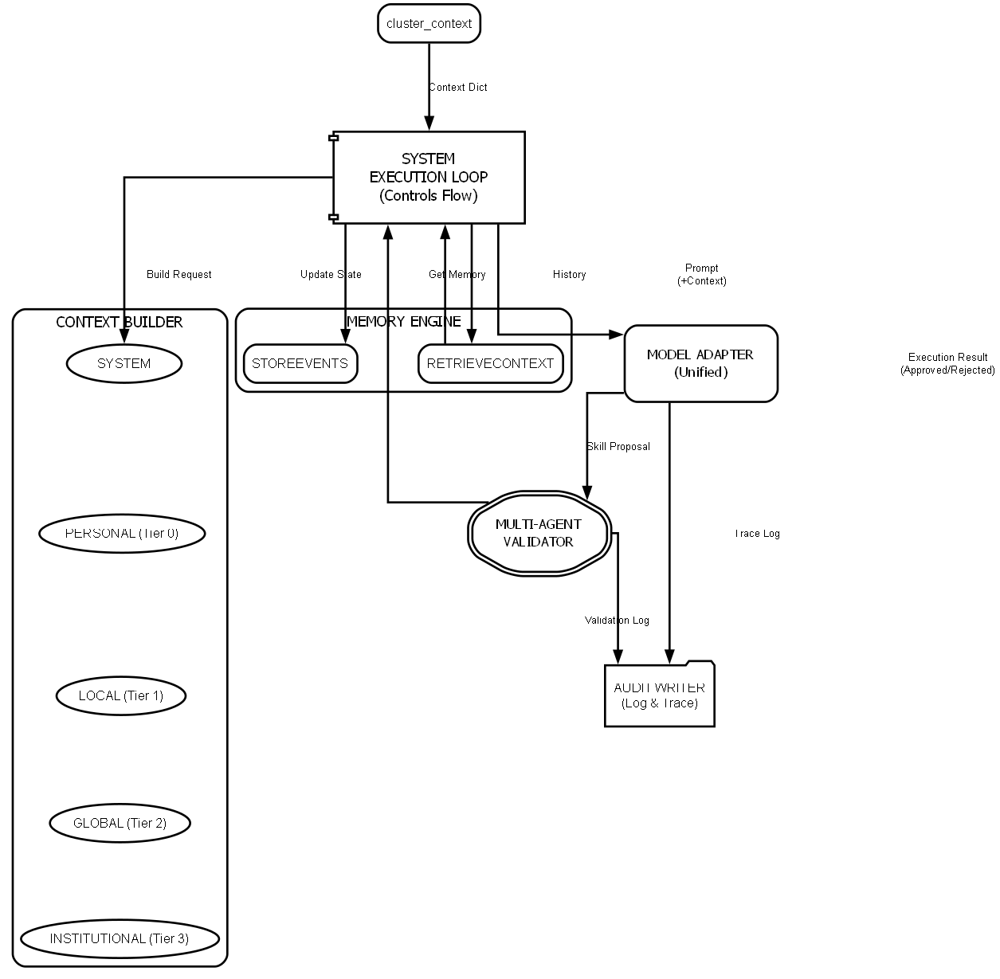

# Governed Broker Framework

**🌐 Language / 語言: [English](README.md) | [中文](README_zh.md)**

<div align="center">

**針對 LLM 驅動 Agent-Based Model 的理性治理中間件**

[](https://www.python.org/downloads/)
[](LICENSE)
[](https://ollama.com/)

</div>

---

## 📖 核心使命

**Governed Broker Framework** 旨在解決大型語言模型 (LLM) 在模擬中的「邏輯-行動差距 (Logic-Action Gap)」。雖然 LLM 具備極佳的流利性，但在長跨度模擬中常出現隨機不穩定與「記憶沖蝕」等問題。本框架提供了一個**治理層 (Governance Layer)**，負責實時驗證代理人的推理過程是否符合物理約束與心理學理論。


---

## 🏗️ 技術架構

本框架被設計為一個**認知中間件 (Cognitive Middleware)**，將代理人的決策過程 (LLM) 與環境物理規則 (ABM) 完全解耦。



### 核心組件與目錄導覽

| 模組                       | 角色                                     | 目錄路徑                                   |
| :------------------------- | :--------------------------------------- | :----------------------------------------- |
| **技能註冊表 (Registry)**  | 定義動作空間、成本與物理限制條件。       | [`broker/core/`](broker/core/)             |
| **技能仲裁器 (Broker)**    | 強制執行邏輯/行動一致性驗證。            | [`broker/core/`](broker/core/)             |
| **記憶引擎 (Memory)**      | 指導性的分層記憶檢索 (近期/顯著/情感)。  | [`broker/components/`](broker/components/) |
| **反思引擎 (Reflection)**  | 長期語義固化，生成高階「反思洞察」。     | [`broker/components/`](broker/components/) |
| **上下文建構器 (Builder)** | 為代理人合成無偏差的有界現實。           | [`broker/components/`](broker/components/) |
| **環境模擬 (Simulation)**  | 管理物理狀態演變與外部衝擊（如：洪水）。 | [`simulation/`](simulation/)               |

---

## 🛠️ 框架特色

- **場景感知治理 (Context Governance)**：透過結構化現實感知，有效抑制模型幻覺。
- **認知干預機制 (Cognitive Intervention)**：實時檢查代理人的推理 (Thinking Rules) 是否與最終決策一致。
- **以人為本的記憶**：引入情感編碼與隨機固化，防止「金魚效應 (The Goldfish Effect)」。
- **多階段魯棒解析**：專為小模型設計，即使 JSON 格式受損也能救回關鍵洞察。

---

## 🚀 部署與執行

### 環境配置

```bash
git clone https://github.com/WenyuChiou/governed-broker-framework.git
cd governed-broker-framework
pip install -r requirements.txt
```

### 執行模擬

框架內含針對水文社會適應性與壓力測試的專屬基準測試：

- **[JOH 基準測試 (單代理人)](examples/single_agent/)**：住戶洪水適應的縱向研究。包含詳細的實驗結果報告與行為指標。
- **[多代理人動態模擬](examples/multi_agent/)**：複雜社交互動與同儕影響模擬。

---

## 🗺️ 框架演進路徑


---

**聯絡方式**: [Wenyu Chiou](https://github.com/WenyuChiou)
