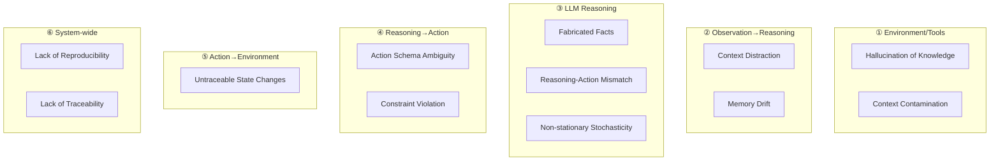

# LLM-ABM 風險問題清單與緩解策略

## Overview: LLM-Agent Loop 中的 12 個核心問題



---

## 問題對照表

| ID | Problem | Stage | Current Mitigation | Status |
|----|---------|-------|-------------------|--------|
| A | Hallucination of knowledge | ① Env→Obs | Strict prompt context | ⚠️ Partial |
| B | Context contamination | ① Env→Obs | Separate sections in prompt | ⚠️ Partial |
| C | Context distraction | ② Obs→Reason | CognitiveMemory with decay | ⚠️ Partial |
| D | Memory drift | ② Obs→Reason | State-based memory | ⚠️ Partial |
| E | Fabricated facts | ③ Reasoning | Validator R8 (PA consistency) | ⚠️ Partial |
| F | Reasoning-action mismatch | ③ Reasoning | Validator R1 (TP+CP→action) | ✅ Addressed |
| G | Non-stationary stochasticity | ③ Reasoning | Fixed seed, temperature=0 | ⚠️ Partial |
| H | Action schema ambiguity | ④ Reason→Action | Skill Registry | ✅ Addressed |
| I | Constraint violation | ④ Reason→Action | Validator R3,R4,R6,R9 | ✅ Addressed |
| J | Untraceable state changes | ⑤ Action→Env | Audit Writer (JSONL) | ✅ Addressed |
| K | Lack of reproducibility | ⑥ System | Seed, deterministic retrieval | ⚠️ Partial |
| L | Lack of traceability | ⑥ System | Full audit trail | ✅ Addressed |

---

## ① Environment / Tools → Observation

### A. Hallucination of Knowledge (Over-knowledge)

**問題：**
- Agent 可能「知道」超出其 observation 範圍的資訊
- 例如：知道所有人的損失、未來政策、全域統計

**目前緩解：**
```python
# prompts.py - 只提供 agent 可見的資訊
HOUSEHOLD_PROMPT = """
=== YOUR CURRENT SITUATION ===
{elevation_status}        # 只有自己的狀態
{insurance_status}        # 只有自己的保險
{damage_history}          # 只有自己的損失記錄

=== YOUR MEMORY ===
{memory}                  # 只有自己的記憶
"""
# 不提供: 鄰居損失、全局統計、未來預測
```

**缺失：**
- [ ] 未驗證 LLM 回應是否引用了 prompt 外的知識
- [ ] 未阻止 LLM 假設「我知道鄰居的情況」

**改進方向：**
```python
# 新增 Knowledge Boundary Validator
class VA_KnowledgeBoundary(ValidationRule):
    """Check if LLM assumes knowledge outside prompt"""
    def check(self, output, state):
        forbidden_phrases = ["I know that neighbors", "statistics show", "in the future"]
        for phrase in forbidden_phrases:
            if phrase.lower() in output.justification.lower():
                return f"Agent assumed out-of-scope knowledge: {phrase}"
        return None
```

---

### B. Context Contamination

**問題：**
- Tool output + Prompt + History 混在一起
- LLM 無法區分 observation vs 系統說明 vs 推測

**目前緩解：**
```python
# prompts.py - 使用明確分隔
HOUSEHOLD_PROMPT = """
=== CONSTRUCT DEFINITIONS ===    # 系統說明
...

=== YOUR CURRENT SITUATION ===   # Observation (State)
...

=== YOUR MEMORY ===              # Observation (Memory)
...

=== THIS YEAR'S CONDITIONS ===   # Environment
...

=== YOUR TASK ===                # 指令
...
"""
```

**缺失：**
- [ ] 未驗證 LLM 是否正確區分這些區域
- [ ] 沒有 structural encoding (只靠文字分隔)

---

## ② Observation → LLM Reasoning

### C. Context Distraction / Confusion

**問題：**
- 長期模擬中，重要事件可能被擠出 context window
- Retrieval 可能撈到語義相似但因果不重要的內容

**目前緩解：**
```python
# broker/memory.py - CognitiveMemory
class CognitiveMemory:
    def retrieve(self, top_k=5, current_year=0):
        """
        Scoring: recency * importance
        - 近期事件優先
        - 高重要性事件優先
        """
```

**缺失：**
- [ ] 未驗證 retrieval 結果是否因果相關
- [ ] 無法區分「語義相似」vs「因果重要」

**改進方向：**
```python
# 新增 Causal Relevance Scoring
def retrieve_causal(self, current_decision_type: str):
    """Retrieve memories causally relevant to current decision"""
    # E.g., when considering insurance, prioritize past flood damage memories
```

---

### D. Implicit Memory Drift

**問題：**
- 「記憶」存在於 prompt history / retrieval embedding
- 並非系統 state，歷史影響不可控

**目前緩解：**
```python
# Memory 是 state 的一部分
class HouseholdAgent:
    state: HouseholdAgentState
    memory: CognitiveMemory  # Persisted as state

# memory_item 是 dataclass
@dataclass
class MemoryItem:
    content: str
    importance: float
    year: int
    timestamp: datetime
```

**缺失：**
- [ ] Memory 沒有被 serialized 到 audit
- [ ] 無法驗證「記憶」vs「state」的一致性

---

## ③ LLM Reasoning (Core Black Box)

### E. Hallucination (Fabricated Facts or Rules)

**問題：**
- LLM 編造未發生的損失、不存在的條件

**目前緩解：**
```python
# validators.py - R8 PA Consistency
class R8_PAConsistency(ValidationRule):
    """PA level should match actual state"""
    def check(self, output, state):
        actual_pa = compute_actual_pa(state)
        if output.pa_level != actual_pa:
            return f"PA={output.pa_level} doesn't match actual state"
```

**缺失：**
- [ ] 未驗證 TP/CP/SP/SC 的 explanation 是否基於 prompt 內容
- [ ] LLM 可能編造「我經歷過的損失」

---

### F. Inconsistency (Reasoning–Action Mismatch) ✅

**問題：**
- LLM 說「有錢、有信心、風險高」但不買保險

**目前緩解：**
```python
# validators.py - R1
class R1_HighTPCPDoNothing(ValidationRule):
    """HIGH TP + HIGH CP → Should NOT do_nothing"""
    def check(self, output, state):
        if output.tp_level == "HIGH" and output.cp_level == "HIGH":
            if output.decision_skill == "do_nothing":
                return "HIGH threat + HIGH coping but chose do_nothing"
```

**Status: ✅ Addressed**

---

### G. Non-stationary Stochasticity

**問題：**
- 同一條件，不同 sampling → 不同行為
- 無法區分行為異質性 vs 模型噪音

**目前緩解：**
```python
# run_experiment.py
SEED = 42  # Fixed seed for random components

# LLM call (Ollama)
response = requests.post(
    "http://localhost:11434/api/generate",
    json={
        "model": model,
        "prompt": prompt,
        "stream": False,
        # "temperature": 0  # TODO: Add for reproducibility
    }
)
```

**缺失：**
- [ ] 未設定 temperature=0
- [ ] 未記錄 LLM 版本 / sampling parameters

**改進方向：**
```python
LLM_CONFIG = {
    "temperature": 0,
    "top_p": 1,
    "seed": 42
}
```

---

## ④ LLM Reasoning → Action

### H. Action Schema Ambiguity ✅

**問題：**
- Action 名稱、參數、條件不完整

**目前緩解：**
```yaml
# skill_registry.yaml
household_owner_skills:
  - skill_id: elevate_house
    description: "Elevate house structure..."
    eligible_agent_types: ["household_owner"]
    preconditions:
      - "not elevated"
    institutional_constraints:
      once_only: true
```

**Status: ✅ Addressed**

---

### I. Constraint Violation ✅

**問題：**
- 忽略 budget, once-only, eligibility

**目前緩解：**
```python
# validators.py
R3: Already elevated → Cannot elevate again
R4: Renter → Cannot elevate
R6: Already relocated → Cannot take action
R9: Renter valid actions only
```

**Status: ✅ Addressed**

---

## ⑤ Action → Environment Change

### J. Untraceable State Changes ✅

**問題：**
- 無法追蹤 reasoning → action → state 的因果鏈

**目前緩解：**
```python
# audit_writer.py - Full trace
trace = {
    "year": output.year,
    "agent_id": output.agent_id,
    "state": {...},               # State before decision
    "constructs": {               # LLM reasoning
        "TP": {"level": ..., "explanation": ...},
        ...
    },
    "decision_skill": output.decision_skill,
    "justification": output.justification,
    "validated": output.validated
}
```

**Status: ✅ Addressed**

---

## ⑥ 整個 Loop (系統性問題)

### K. Lack of Reproducibility ⚠️

**問題：**
- 即使初始條件相同，結果可能不同

**目前緩解：**
- Fixed seed for random components
- Deterministic data loading

**缺失：**
- [ ] LLM sampling 不確定
- [ ] Retrieval 順序可能不穩定

**改進方向：**
```python
# 完整 reproducibility config
REPRODUCIBILITY = {
    "random_seed": 42,
    "llm_temperature": 0,
    "llm_seed": 42,
    "retrieval_deterministic": True,
    "model_version": "llama3.2:3b"
}
```

---

### L. Lack of Traceability ✅

**問題：**
- 無法建立 state → reasoning → action → state 因果鏈

**目前緩解：**
```
audit_trail:
├── household_audit.jsonl     # All decisions with full context
├── institutional_audit.jsonl  # Insurance/Government
└── audit_summary.json        # Aggregate statistics
```

**Status: ✅ Addressed**

---

## 總結：緩解狀態

| Status | Count | Problems |
|--------|-------|----------|
| ✅ Addressed | 5 | F, H, I, J, L |
| ⚠️ Partial | 7 | A, B, C, D, E, G, K |

### 優先改進項目

1. **G: Temperature = 0** - 立即可做
2. **A: Knowledge Boundary Validator** - 驗證 LLM 未使用 prompt 外知識
3. **K: Full Reproducibility Config** - 記錄所有隨機因素
4. **E: Explanation Validation** - 驗證 reasoning 內容基於 prompt
