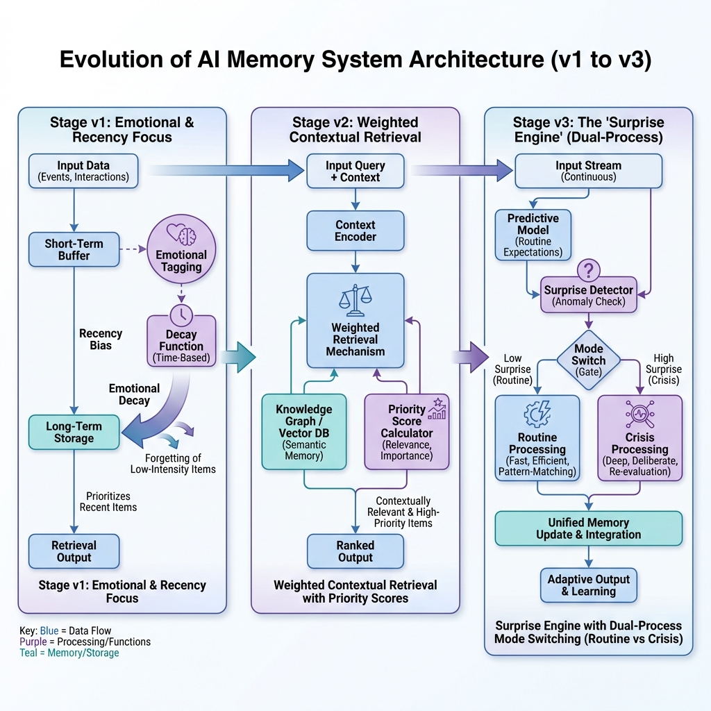

# 組件：記憶與檢索系統

**🌐 語言：[English](memory_components.md) | [中文](memory_components_zh.md)**

**記憶與檢索系統** 是代理人過去經驗與當前決策之間的認知橋樑。在該框架中，我們明確地將 **記憶 (存儲)** 與 **檢索 (訪問控制)** 解耦，以確保代理人在高資訊密度下仍能保持理性。

---

## 🏛️ 記憶演進與路線圖

本系統是一個基於認知科學的 **通用認知架構**，在檢索深度上演進出三個階段。



---

## 1. 記憶生命週期：從感知到提示詞

要理解代理人如何「回憶」，我們需要跟蹤一個單一事件的完整生命週期：

### 第一步：記憶系統、評估與參數辭典

#### **A. 記憶系統的戰略對照：**

| 特性         | 模型 v1：繼承模式 (習慣)        | 模型 v2：加權模式 (深思)             | 模型 v3：通用模式 (兩者) |
| :----------- | :------------------------------ | :----------------------------------- | :----------------------- |
| **檢索邏輯** | **基於顯著性**。                | **統一評分制**。                     | **驚奇驅動選通**。       |
| **核心公式** | $S(t) = I \cdot e^{-\lambda t}$ | $S = W_{rec}R + W_{imp}I + W_{ctx}C$ | 在 v1 與 v2 之間切換。   |
| **設計哲學** | **可得性捷思 (Availability)**。 | **情境關聯性 (Contextual)**。        | **認知喚起 (Arousal)**。 |
| **行為目標** | 記得「最近的震撼」。            | 記得「相關的歷史」。                 | **習慣** 直到 **驚奇**。 |

#### **B. 參數與符號辭典 (數值範圍：0.0 至 1.0)：**

| 符號          | 組件 / 參數    | 默認值 | 定義                                                           |
| :------------ | :------------- | :----- | :------------------------------------------------------------- |
| **$R$**       | **時間分數**   | (計算) | $1 - (\text{age} / \text{max\_age})$：記憶新鮮度（現在=1.0）。 |
| **$I$**       | **重要性分數** | (計算) | $I_{initial} \cdot e^{-\lambda t}$：經時間衰減後的顯著性。     |
| **$C$**       | **情境分數**   | (計算) | 二元匹配：當前場景關鍵字與記憶標記是否吻合。                   |
| **$PE$**      | **預測誤差**   | (計算) | 「驚奇」程度 (現狀 vs 預期)。v3 切換閥值。                     |
| **$\lambda$** | **衰減率**     | 0.1    | 遺忘常數，決定 v1 記憶消失的速度。                             |
| $W_{rec}$     | **時間權重**   | 0.3    | 檢索時對「新鮮度」的重視程度。                                 |
| $W_{imp}$     | **重要性權重** | 0.5    | 檢索時對「歷史意義 ($I$)」的重視程度。                         |
| $W_{ctx}$     | **情境權重**   | 0.2    | 檢索時環境「喚醒往事 ($C$)」的強度。                           |
| $I_{gate}$    | **固化門檻**   | 0.6    | 嘗試進入永久存檔所需的最低 $I_{initial}$。                     |
| $P_{burn}$    | **固化機率**   | 0.8    | 通過門檻後，記憶成功固化的機率。                               |

> [!NOTE]
> **為什麼 $R, C, PE$ 被稱為「變動變數 (Dynamic Variables)」？**
> 與固定的權重參數 ($W$) 不同，這些數值在每次檢索或感知時都會被「重新計算」：
>
> - **$R$ (時間分數)**：隨時間推移而變動。同樣的一段回憶，在第 1 年看它是「昨天 (R=1.0)」，在第 10 年看它就是「遠古 (R=0.1)」。
> - **$C$ (情境分數)**：隨「當前情境」變動。如果你現在在處理「洪水」，這筆記憶的 C 就是 1.0；如果你在處理「火災」，這筆記憶的 C 就是 0.0。
> - **$PE$ (預測誤差)**：隨「當前現實與期待的落差」變動。它是每個模擬週期的「驚奇感」即時反映。

---

## 2. 實戰案例：住戶代理人的記憶檢索軌跡

**當前情境 (第 11 年)**：天氣預報發布了 **紅色預警**。氣象局稱：「預計將有特大暴雨，河流泛濫風險極高。」

> **當前場景關鍵字**：`[洪水, 危險, 暴雨]`

代理人的長期存檔中存有以下兩段具體的敘事記憶：

- **記憶 A (災難性創傷)**：「第一年，一場巨大的洪水沖垮了堤防。我的地下室淹水深達兩英尺，家具全毀了，當時的情景非常恐怖。」
  - **屬性**：$I_{initial}=1.0$, Age=10, 標記: `[洪水]`。
- **記憶 B (日常生活)**：「第十年，整天都是大太陽。我下午在後院修剪花木，度過了一個平凡而安靜的週六。」
  - **屬性**：$I_{initial}=0.1$, Age=1, 標記: `[常規]`。

---

#### **模型 v1：習慣型代理人 (Habit)**

v1 僅根據遺忘曲線的顯著性 ($I \cdot e^{-\lambda t}$) 排序：

1.  **記憶 A 評分**：$1.0 \cdot e^{-(0.1 \times 10)} = 0.36$。
2.  **記憶 B 評分**：$0.1 \cdot e^{-(0.1 \times 1)} \approx 0.09$。
3.  **分析**：雖然記憶 A 的分值較高，但它正與 **工作記憶窗口** 中數以百計像記憶 B 這樣分數接近 $1.0$ 的「近期大晴天」競爭。
4.  **結果**：代理人因「正常化偏見」而保持冷漠，**忽略了預警**，因為過去九年的安逸經驗佔據了主要思維。

---

#### **模型 v2：理性型代理人 (Deliberate)**

v2 使用公式 $S = (R \times 0.3) + (I \times 0.5) + (C \times 0.2)$。

1.  **記憶 A (洪水創傷)**:
    - **數學推導**: $(R=0.0 \times 0.3) + (I=0.36 \times 0.5) + (C=1.0 \times 0.2) = 0.0 + 0.18 + 0.20 = \mathbf{0.38}$
    - **關鍵點**: 因當前預警包含「洪水」關鍵字，**情境分數 ($C$) 直接跳至 1.0**。
2.  **記憶 B (日常修剪)**:
    - **數學推導**: $(R=0.9 \times 0.3) + (I=0.09 \times 0.5) + (C=0.0 \times 0.2) = 0.27 + 0.045 + 0.0 = \mathbf{0.315}$
    - **關鍵點**: 雖然非常新鮮 ($R=0.9$)，但與當前危機情境完全不相關。
3.  **分析**：**0.38 > 0.315**。十年前的慘痛教訓在評分上強行超越了去年的平淡日子。
4.  **結果**：代理人立刻被喚回創傷記憶，並 **決定購買洪水保險**。

---

## 3. v3：通用記憶引擎 (驚奇引擎)

v3 是整個認知架構的「控制器」。它模擬了 **「喚起迴路 (Arousal Loop)」** —— 決定代理人何時該依循習慣 (v1)，以及何時該醒轉並展現理性 (v2)。

### 🧠 喚起迴路的運作機制

1.  **感官輸入 ($Reality$, 來自 State)**：
    在每個模擬週期，引擎會讀取 `world_state`。在我們的案例中，它追蹤的是「洪水水位 (flood_depth)」。這是一個 **變動的環境狀態變數 (Dynamic State Variable)**。
2.  **內部預期 ($Expectation$)**：
    代理人使用 **EMA 預測器 (Exponential Moving Average)** 維持一個內部的「常態模型」。
    - **公式**：$E_t = (\alpha \times R_t) + ((1 - \alpha) \times E_{t-1})$
    - 這創造了 **「常態偏見 (Normalcy Bias)」**：即使洪水開始上漲，代理人的「心理預期」也會緩慢移動，導致現實與信念之間產生落差。

3.  **預測誤差 ($PE$, 驚奇值)**：
    「驚奇度」即為絕對差值：$PE = |\text{現實} - \text{期待}|$。
    - **動態計算**：當現實水位暴漲時，$PE$ 也會隨之飆升。
    - **動態切換 (Dynamic Toggling)**：
      - 若 $PE < \text{喚起閾值}$ (0.5)：代理人保持在 **系統一 (模型 v1)**。它信任習慣，並過濾掉深層的存檔記憶。
      - 若 $PE \ge \text{喚起閾值}$：代理人進入 **系統二 (模型 v2)**。這會觸發「情境全搜索」，啟動加權評分，進而喚回十年前的創傷。

### 🔄 v3 會隨狀態 (State) 改變嗎？

**是的。** v3 的所有核心指標都是「狀態依賴」的：

- **Reality (現實)**：直接由環境 `world_state` 輸入。
- **Expectation (期待)**：根據每一輪的新觀察進行學習與更新。
- **Arousal Mode (喚起模式)**：根據「環境與心智的落差」即時在「繼承模式」與「加權模式」之間翻轉。

> [!TIP]
> **理論連結**：這完美實作了 **主動推理 (Active Inference, Friston, 2010)** —— 大腦的目標是最小化驚奇度；以及 **《快思慢想》(Kahneman, 2011)** 中定義的兩種思考速度。

---

## 4. ⚙️ 配置與參考文獻

```yaml
memory_config:
  type: "universal" # v3
  params:
    arousal_threshold: 0.5
    W_recency: 0.3
    W_importance: 0.5
    W_context: 0.2
```

[1] Tversky & Kahneman (1973). _Availability Heuristic_. (v1: 心理學基礎，說明代理人為何會受到新鮮度與顯著性的偏誤影響)。
[2] Friston (2010). _The free-energy principle_. (v3: 驚奇引擎的理論基礎，說明生物如何透過最小化預測誤差來分配資源)。
[3] Ebbinghaus (1885). _Forgetting Curve_. (v1/v2: 描述記憶隨時間衰減的數學模型)。
[4] Park et al. (2023). _Generative Agents_. (v2: **加權模式**的直接文獻來源，定義了「新鮮度、重要性、相關性」的三元檢索邏輯)。
[5] Kahneman (2011). _Thinking, Fast and Slow_. (v3: **雙系統理論**的文獻來源，定義了系統一（習慣）與系統二（理性）的切換)。
