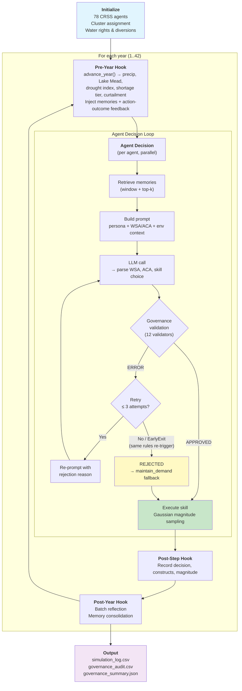

# Irrigation ABM — WAGF Adaptation of Hung & Yang (2021)

LLM-driven reproduction of the Colorado River Basin irrigation ABM from Hung & Yang (2021, *Water Resources Research*). 78 agricultural water users make annual demand decisions using natural-language reasoning — guided by governance rules and episodic memory — instead of Fuzzy Q-Learning (FQL).

**Key terms**: CRSS (Colorado River Simulation System), MAF (million acre-feet), AF (acre-feet), DCP (Drought Contingency Plan), USBR (U.S. Bureau of Reclamation), WSA/ACA (Water Scarcity / Adaptive Capacity Assessment), CoV (coefficient of variation).

---

## 1. Quick Start

```bash
# Smoke test (5 synthetic agents, 5 years)
python run_experiment.py --model gemma3:4b --years 5 --agents 5

# Validation (10 synthetic agents, 10 years)
python run_experiment.py --model gemma3:4b --years 10 --agents 10 --seed 42

# Production (78 real CRSS agents, 42 years — requires ref/CRSS_DB data)
python run_experiment.py --model gemma3:4b --years 42 --real --seed 42 --num-ctx 8192 --num-predict 4096
```

### Key CLI Flags

| Flag | Default | Description |
| :--- | :------ | :---------- |
| `--model` | `gemma3:1b` | Ollama model name |
| `--years` | `5` | Simulation years |
| `--agents` | `5` | Number of agents (synthetic mode) |
| `--real` | disabled | Use 78 real CRSS agents instead of synthetic |
| `--seed` | `42` | Random seed for reproducibility |
| `--workers` | `1` | Parallel LLM workers |

Run `python run_experiment.py --help` for all flags (memory, magnitude, context window, etc.).

### Project Structure

```text
irrigation_abm/
  run_experiment.py          # Main runner (ExperimentBuilder pipeline)
  irrigation_env.py          # Water system simulation environment
  irrigation_personas.py     # Cluster persona builder + context helpers
  config/
    agent_types.yaml         # Agent config, governance rules, personas
    skill_registry.yaml      # Available irrigation skills
    policies/                # Domain-specific governance policies
    prompts/                 # LLM prompt templates
  validators/
    irrigation_validators.py # 12 custom governance validators
  learning/
    fql.py                   # Reference FQL algorithm (not used by LLM runner)
```

### Output Files

```text
results/<run_name>/
  simulation_log.csv                     # Year, agent, skill, constructs, magnitude
  irrigation_farmer_governance_audit.csv # Governance interventions
  governance_summary.json                # Aggregate audit stats
  config_snapshot.yaml                   # Reproducibility snapshot
  raw/irrigation_farmer_traces.jsonl     # Full LLM traces
  reflection_log.jsonl                   # Memory consolidation events
```

---

## 2. Production Results (v20)

**Experiment**: 78 agents × 42 years, gemma3:4b, strict governance, seed 42.

### Headline Metrics

| Metric | Value | CRSS Reference |
| :----- | :---- | :------------- |
| Mean demand | 5.87 MAF/yr | 5.86 MAF/yr (1.00×) |
| Steady-state CoV (Y6-42) | 5.3% | Target <10% |
| Within ±10% corridor | 88% (37/42 yr) | — |
| Cold-start mean (Y1-5) | 4.76 MAF | Excluded from steady-state stats |

### Governance Outcomes

3,276 agent-year decisions:

| Outcome | Count | Percentage |
| :------ | ----: | ---------: |
| Approved (1st attempt) | 1,236 | 37.7% |
| Retry success | 735 | 22.4% |
| Rejected → maintain_demand | 1,305 | 39.8% |

### Behavioral Diversity

| Stage | H_norm | Meaning |
| :---- | -----: | :------ |
| Proposed (LLM choice) | 0.74 | Agents express diverse preferences |
| Executed (after governance) | 0.39 | Governance compresses to feasible subset |
| Compression | 47% | Institutional constraint narrowing |

### Interpretation

- **Demand stability**: Steady-state demand (Y6-42) remains within the CRSS ±10% corridor, achieving the same collective equilibrium as Hung & Yang (2021) FQL, but through governance constraints rather than Q-value convergence.
- **Cold-start transient**: Y1-5 mean demand is 4.76 MAF (19% below CRSS), reflecting zero-memory initialization. FQL also exhibits early exploration instability.
- **Persistent intervention**: 62% of decisions require governance intervention (retry + rejected). This is a structural feature — bounded-rationality LLM agents in chronic drought require external constraint.
- **Cluster differentiation**: Aggressive agents face 43 percentage-point governance compression (propose 60% increase → execute 17%), while Myopic agents face near-zero compression (98% maintain).
- **Top rule triggers**: demand_ceiling_stabilizer (1,420) > high_threat_high_cope_no_increase (1,180) > curtailment_awareness (499).

---

## 3. System Architecture

### Three Pillars

| Pillar | Name | Effect |
| :----- | :--- | :----- |
| 1 | **Strict Governance** | 12 validators block physically impossible or redundant actions |
| 2 | **Cognitive Memory** | `HumanCentricMemoryEngine` (basic ranking mode) + year-end reflection |
| 3 | **Reflection Loop** | Year-end consolidation with domain-specific guidance questions |

### Simulation Pipeline



See [`irrigation_design_flowchart.drawio.svg`](../../paper/irrigation/figures/irrigation_design_flowchart.drawio.svg) for a high-level system diagram.

---

## 4. Water System Model

The irrigation environment uses a **simplified CRSS mass balance** at annual resolution (same abstraction level as Hung & Yang 2021). Unlike the full CRSS/RiverWare model (monthly, 3,700+ objects), our model reduces the system to a single-reservoir (Lake Mead) annual balance with agent-demand feedback.

**Core equation**: $S(t+1) = S(t) + Q_{in,Mead} - Q_{out,Mead}$, $S \in [2.0, 26.1]$ MAF.

**What the model captures**:

- **Bidirectional agent-reservoir coupling** — agent demand directly affects Lake Mead storage → shortage tiers → curtailment → constrains future agents
- **USBR DCP operating rules** — shortage tiers (1075/1050/1025 ft), curtailment (5%/10%/20%), Mexico treaty reductions (Minute 323)
- **Real CRSS PRISM precipitation** — same climate forcing (2017-2060) used by USBR (National Oceanic and Atmospheric Administration data)
- **Physical constraints** — Powell minimum release (7.0 MAF/yr), Upper Basin ceiling (5.0 MAF/yr)

**Agent diversion**: $d_i(t) = \min(r_i, w_i) \times (1 - \gamma_\tau)$ where $r_i$ = demand request, $w_i$ = water right, $\gamma_\tau$ = curtailment ratio.

### Key Parameters

| Parameter | Value | Source |
| :-------- | :---- | :----- |
| Natural flow baseline | 12.0 MAF/yr | CRSS historical average |
| Min Powell release | 7.0 MAF/yr | USBR DCP floor (2019) |
| UB infrastructure ceiling | 5.0 MAF/yr | Historical UB depletion capacity |
| Mexico treaty delivery | 1.5 MAF/yr | 1944 Treaty (before DCP reductions) |
| Initial elevation | 1081.46 ft | USBR observed December 2018 |
| Simulation period | 2019-2060 | Following Hung & Yang (2021) |

### Shortage Tiers and Curtailment

| Mead Elevation | Tier | Curtailment | Governance Effect |
| :------------- | :--- | :---------- | :---------------- |
| ≥ 1075 ft | 0 (Normal) | 0% | WARNING only |
| 1050-1075 ft | 1 | 5% | WARNING only |
| 1025-1050 ft | 2 | 10% | ERROR: blocks `increase_demand` |
| < 1025 ft | 3 | 20% | ERROR: blocks `increase_demand` |

### Drought Index

Composite severity index in [0, 1]: `drought_index = 0.5 × precip_norm + 0.5 × mead_norm`

| Drought Index | Classification |
| :------------ | :------------- |
| < 0.2 | Normal |
| 0.2-0.5 | Mild drought |
| 0.5-0.8 | Moderate drought |
| > 0.8 | Severe drought |

**[Full mass balance equations, variable definitions, storage-elevation curves, and CRSS comparison](docs/irrigation_physics.md)**

---

## 5. Agent Design

### Behavioral Clusters

Three k-means clusters from Hung & Yang (2021), mapped from FQL parameters to LLM personas:

| Cluster | N (of 78) | LLM Persona | Magnitude default | sigma |
| :------ | --------: | :---------- | ----------------: | ----: |
| **Aggressive** | 67 | Bold, large demand swings | 10.0% | 3.5 |
| **Forward-Looking Conservative** | 5 | Cautious, future-oriented | 7.5% | 3.0 |
| **Myopic Conservative** | 6 | Tradition-oriented, slow updates | 4.0% | 2.0 |

### Action Space (5-Skill)

| # | Skill | FQL Equivalent | Real-World Analog |
| - | :---- | :------------- | :---------------- |
| 1 | `increase_large` | Action 1, high magnitude | Major acreage expansion |
| 2 | `increase_small` | Action 1, low magnitude | Marginal crop intensity increase |
| 3 | `maintain_demand` | Implicit (zero-magnitude) | Status quo under long-term contracts |
| 4 | `decrease_small` | Action 0, low magnitude | Minor conservation adjustments |
| 5 | `decrease_large` | Action 0, high magnitude | Fallowing fields, crop switching |

**Why 5 instead of 2?** The 5-skill design restores FQL's continuous magnitude granularity and enables **differential governance**: Tier 1 shortage blocks `increase_large` (ERROR) but only warns on `increase_small` (WARNING).

### Bounded Gaussian Magnitude Sampling

The LLM chooses **which skill** (qualitative); actual magnitude is sampled from persona-scaled Gaussians at execution time (quantitative). This decouples reasoning from magnitude control.

| Skill | μ (%) | σ | min (%) | max (%) |
| :---- | ----: | -: | ------: | ------: |
| `increase_large` | 12.0 | 3.0 | 8.0 | 20.0 |
| `increase_small` | 4.0 | 1.5 | 1.0 | 8.0 |
| `decrease_small` | 4.0 | 1.5 | 1.0 | 8.0 |
| `decrease_large` | 12.0 | 3.0 | 8.0 | 20.0 |

Each persona multiplies μ and σ by its scale factor (Aggressive: 1.15, Forward-Looking: 1.00, Myopic: 0.80). A 2% exploration rate widens the sampling distribution for occasional novel actions.

### Cognitive Appraisal Constructs (WSA/ACA)

Agents assess two independent dimensions annually, following cognitive appraisal theory (Lazarus & Folkman, 1984):

| Dimension | Construct | Description |
| :-------- | :-------- | :---------- |
| **Threat** | WSA (Water Scarcity Assessment) | Chronic water supply threat based on drought index, curtailment, and tier |
| **Capacity** | ACA (Adaptive Capacity Assessment) | Ability to adapt based on farm resources and technology status |

Both use a 5-level ordinal scale: VL / L / M / H / VH. These labels serve as governance-legible inputs enabling construct-conditioned rules (e.g., WSA=VH + ACA=VH → block increase). Construct validity: 99.2% valid-label coverage (3,250/3,276 decisions).

### Response Format

```json
<<<DECISION_START>>>
{
  "reasoning": "Free-text analysis of water situation...",
  "water_scarcity_assessment": {"label": "M", "reason": "Supply is adequate."},
  "adaptive_capacity_assessment": {"label": "H", "reason": "Strong financial resources."},
  "decision": "1"
}
<<<DECISION_END>>>
```

**Reasoning Before Rating**: The `reasoning` field is placed first to improve autoregressive generation quality. Format is limited to 4 fields (gemma3:4b collapses nested objects when more fields are present).

### Memory & Adaptation

The `HumanCentricMemoryEngine` operates in **basic ranking mode** (5-year window + top-2 by decayed importance, consolidation threshold 0.6, decay rate 0.1). Year-end reflection uses 3 domain-specific guidance questions to consolidate experiences into long-term insights.

**Important limitation**: WAGF agents have **bounded adaptive capacity** — they can recall past experiences and reflect on outcomes, but behavioral stability comes primarily from governance constraints, not agent learning. Shannon entropy shows no convergent learning (slope=+0.003, p=0.25). This parallels FQL's regret penalty: FQL internalizes over-extraction costs via reward function (internal regulation); WAGF externalizes them via governance rules (external regulation).

---

## 6. Governance System

### Rule Hierarchy

WAGF governance uses a **priority-ordered rule chain** with three distinct levels:

1. **Identity Rules** — Hard physical constraints (always enforced first)
2. **Thinking Rules** — Appraisal coherence (evaluated in priority order)
3. **Domain Validators** — Custom checks (physical, social, economic, temporal, behavioral)

ERROR-level violations reject the action and re-prompt the LLM (up to 3 governance retries). WARNING-level rules log concerns but allow the action to proceed.

### Complete Validator Summary (12)

| # | Validator | Blocks | Level | Category |
| - | :-------- | :----- | :---- | :------- |
| 1 | `water_right_cap_check` | increase (at cap) | ERROR | Physical |
| 2 | `non_negative_diversion_check` | decrease (diversion=0) | ERROR/WARNING | Physical |
| 3 | `minimum_utilisation_check` | decrease (<10%) | ERROR | Physical |
| 4 | `demand_floor_stabilizer` | decrease (<50%) | ERROR | Economic |
| 5 | `demand_ceiling_stabilizer` | increase (basin >6.0 MAF) | ERROR | Economic |
| 6 | `drought_severity_check` | increase (drought>0.7) | ERROR | Physical |
| 7 | `magnitude_cap_check` | increase (exceeds cap) | WARNING | Physical |
| 8 | `supply_gap_block_increase` | increase (fulfil<70%) | ERROR | Physical |
| 9 | `curtailment_awareness_check` | increase (Tier 2+) | ERROR | Social |
| 10 | `compact_allocation_check` | increase (basin>Compact) | WARNING | Social |
| 11 | `consecutive_increase_cap_check` | increase (3yr streak) | ERROR | Temporal |
| 12 | `zero_escape_check` | maintain (<15% util) | ERROR | Behavioral |

### Demand Corridor (Floor + Ceiling)

The demand corridor is the primary stabilization mechanism:

```text
10%   ← hard floor (minimum_utilisation_check)
50%   ← stability floor (demand_floor_stabilizer)
       ← agent freedom zone
6.0 MAF ← basin ceiling (demand_ceiling_stabilizer)
100%  ← water right cap (per-agent legal limit)
```

- **Floor (50%)**: Real irrigation districts have minimum delivery obligations. Without it, demand collapsed to 69% of CRSS target during calibration. Equivalent to FQL's under-utilization penalty.
- **Ceiling (6.0 MAF)**: CRSS baseline = 5.86 MAF; ceiling = 1.024× buffer. Without it, demand overshot +12.6%. Equivalent to FQL's regret penalty for over-extraction.

In every scenario, at least `maintain_demand` remains available — no all-skills-blocked trap.

### Design Corrections

- **Suggestion bias**: All ERROR suggestions now use **neutral phrasing** ("Valid alternatives: maintain_demand, decrease_demand") because small LLMs (gemma3:4b) treat suggestions as directives.
- **REJECTED handling**: Rejected agents execute `maintain_demand` as fallback (not no-op), preserving their request and recalculating diversion.
- **Economic hallucination defense**: Four-layer defense against operationally absurd actions (MIN_UTIL floor → diminishing returns taper → governance identity rule → builtin validator).

---

## 7. Comparison with Hung & Yang (2021) FQL

| Aspect | FQL | WAGF |
| :----- | :--- | :--- |
| **Decision mechanism** | Epsilon-greedy Q-value ordering | LLM reasoning + governance validation |
| **Action space** | 2 continuous (increase/decrease) | 5 discrete skills with Gaussian magnitude |
| **Learning** | TD(0) Q-updates → convergence | Memory + reflection (no convergence) |
| **Self-regulation** | Regret penalty in reward function | Demand corridor (floor 50% + ceiling 6.0 MAF) |
| **Explainability** | Q-table values (opaque) | Natural language audit trail + WSA/ACA labels |
| **Cluster ordering** | From Q-value convergence | Preserved via governance compression |

**What WAGF adds**: (1) Natural-language audit trail for every decision, (2) governance compression as information-theoretic metric (H_norm 0.74→0.39), (3) domain transfer without algorithm redesign (same broker engine used for flood PMT domain).

**What WAGF loses**: (1) No convergence guarantee, (2) 39.8% rejection waste (all FQL actions are valid), (3) single seed vs. FQL's 100-trace ensemble, (4) no objective function.

**Note**: This comparison does not claim LLM agents are "better" than FQL. The goal is to demonstrate *scientifically plausible* demand trajectories under governance.

---

## 8. Assumptions and Simplifications

**Agent behavior**: No inter-agent communication; annual decision frequency; homogeneous curtailment (no prior appropriation doctrine); fixed persona assignment throughout simulation.

**Water system**: Single-reservoir model (Lake Mead only; Powell implicit via 7.0 MAF/yr minimum release); annual resolution; static non-agricultural demand (5.0 MAF/yr for CAP — Central Arizona Project, MWD — Metropolitan Water District, and other Municipal & Industrial uses); no groundwater.

**LLM-specific**: Magnitude-reasoning decoupling (LLM chooses skill direction, not magnitude); results specific to gemma3:4b; ERROR-level governance cannot be overridden (design choice prioritizing physical consistency over agent autonomy).

---

## 9. Data Availability

All data for `--real` mode (78 CRSS agents) is included in `ref/CRSS_DB/`:

- **Precipitation**: `HistoricalData/PrismWinterPrecip_ST_NOAA_Future.csv` (CRSS/NOAA PRISM, 2017-2060)
- **Agent water rights**: `annual_baseline_time_series.csv` (78 agents)
- **Elevation curves**: Hardcoded in `irrigation_env.py` (USBR 2009 area-capacity survey)

Synthetic mode requires no external data. Reproducibility: all production runs use `--seed 42`; config captured in `config_snapshot.yaml`.

---

## 10. References

Hung, F., & Yang, Y. C. E. (2021). Assessing adaptive irrigation impacts on water scarcity in nonstationary environments — A multi-agent reinforcement learning approach. *Water Resources Research*, 57, e2020WR029262. <https://doi.org/10.1029/2020WR029262>

Lazarus, R. S., & Folkman, S. (1984). *Stress, Appraisal, and Coping*. Springer.

Ostrom, E. (1990). *Governing the Commons: The Evolution of Institutions for Collective Action*. Cambridge University Press.
