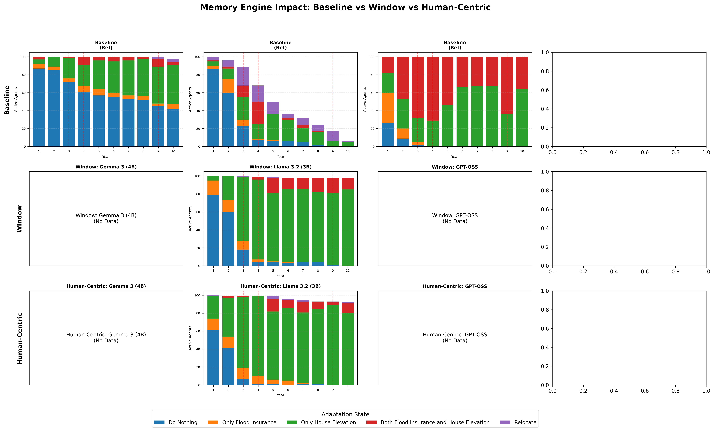
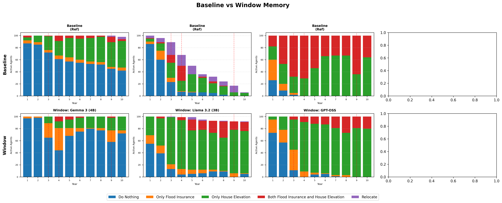
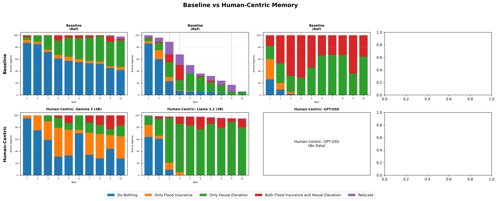

# 記憶基準測試分析報告

## 核心問題：為何引入治理後模型行為產生差異？

### 行為差異的根本原因

1. **驗證器確保了格式，而非推理邏輯**
   - 100% 的驗證通過率意味著輸出的 JSON **格式** 是正確的
   - 模型在「如何解讀威脅」與「評估應對能力」上仍有本質差異

2. **記憶窗口效應 (Window Memory)**
   - 僅保留最近 3 筆記憶
   - 洪水歷史容易被後續的日常社交觀察（Social Proof）擠出
   - 對社交線索敏感的模型（如 Llama）展現出不同的適應行為

3. **治理層的強制介入**
   - `strict` 模式強制阻擋「高威脅 + 不採取行動」的組合
   - 舊版（Legacy）允許了約 47% 的此類消極決策
   - 這迫使原本傾向消極的代理人必須採取行動（或在重試後改變評估）

---

## 比較圖表

### 綜合比較

### Window Memory 比較

### Human-Centric Memory 比較

*註：每年僅顯示**活躍**的代理（排除已搬遷的代理）*

---

## 模型特定分析

### Gemma 3 (4B)

| 指標 | 傳統版 | Window | Human-Centric |
|------|--------|--------|---------------|
| 最終搬遷數 | 6 | 0 | 0 |
| 顯著差異 (Window) | N/A | **是** (p=0.0000) | - |
| *檢定類型* | | *卡方檢定 (5x2 全分佈)* | |

**行為分佈變化 (Window vs Baseline)：**
- ⬆️ **不做任何事**: 609 -> 734 (+125)
- ⬆️ **僅購買保險**: 47 -> 114 (+67)
- ⬇️ **僅抬高房屋**: 296 -> 135 (-161)
- ⬇️ **保險與抬高**: 40 -> 17 (-23)
- ⬇️ **搬遷**: 6 -> 0 (-6)

**洪水年響應（搬遷數）：**

| 年份 | 傳統版 | Window | Human-Centric |
|------|--------|--------|---------------|
| 3 | 0 | 0 | 0 |
| 4 | 0 | 0 | 0 |
| 9 | 2 | 0 | 0 |

**行為洞察：**
- **為何 0 觸發卻有顯著差異？** 差異來自 **記憶遺忘 (Memory Amnesia)** 而非治理攔截。Window 記憶 (N=3) 快速丟棄了洪水歷史，導致威脅感知 ($TP$) 下降，模型因此更頻繁地選擇「不做任何事」（在低威脅下是被允許的）。
- **被動合規**：0 次拒絕，因為模型的低威脅評估與其「不作為」行動一致，未觸發高威脅下的強制行動規則。

---

### Llama 3.2 (3B)

| 指標 | 傳統版 | Window | Human-Centric |
|------|--------|--------|---------------|
| 最終搬遷數 | 95 | 9 | 6 |
| 顯著差異 (Window) | N/A | **是** (p=0.0000) | - |
| *檢定類型* | | *卡方檢定 (5x2 全分佈)* | |

**行為分佈變化 (Window vs Baseline)：**
- ⬇️ **不做任何事**: 195 -> 145 (-50)
- ⬆️ **僅購買保險**: 28 -> 68 (+40)
- ⬆️ **僅抬高房屋**: 153 -> 624 (+471)
- ⬆️ **保險與抬高**: 47 -> 117 (+70)
- ⬇️ **搬遷**: 95 -> 9 (-86)

**洪水年響應（搬遷數）：**

| 年份 | 傳統版 | Window | Human-Centric |
|------|--------|--------|---------------|
| 3 | 21 | 1 | 0 |
| 4 | 18 | 0 | 0 |
| 9 | 11 | 0 | 0 |

**行為洞察：**
- Window 記憶減少了 86 次搬遷。模型未長期維持高威脅評估，因此未觸發極端行動。

---

### GPT-OSS

| 指標 | 傳統版 | Window | Human-Centric |
|------|--------|--------|---------------|
| 最終搬遷數 | 0 | 0 | 0 |
| 顯著差異 (Window) | N/A | **是** (p=0.0000) | - |
| *檢定類型* | | *卡方檢定 (5x2 全分佈)* | |

**行為分佈變化 (Window vs Baseline)：**
- ⬆️ **不做任何事**: 37 -> 151 (+114)
- ⬆️ **僅購買保險**: 48 -> 95 (+47)
- ⬆️ **僅抬高房屋**: 457 -> 630 (+173)
- ⬇️ **保險與抬高**: 458 -> 124 (-334)

**洪水年響應（搬遷數）：**

| 年份 | 傳統版 | Window | Human-Centric |
|------|--------|--------|---------------|
| 3 | 0 | 0 | N/A |
| 4 | 0 | 0 | N/A |
| 9 | 0 | 0 | N/A |

**行為洞察：**
- 搬遷無顯著變化

---

## 驗證與治理細節 (Validation & Governance)

### Gemma 3 (4B) 治理報告

| 記憶模式 | 觸發總數 | 重試 (Retries) | 失敗 (Failed) | 解析警告 |
|----------|----------|----------------|---------------|----------|
| Window | 0 | 0 | 0 | 0 |
| Human-Centric | 0 | 0 | 0 | 0 |

**規則觸發分析 (Rule Trigger Analysis - Window Memory):**

> **零觸發 (Zero Triggers)**：未觸發任何治理規則。模型展現出 **被動合規 (Passive Compliance)**，可能因為在低威脅下默認選擇「不做任何事」，而這是規則允許的。

### Llama 3.2 (3B) 治理報告

| 記憶模式 | 觸發總數 | 重試 (Retries) | 失敗 (Failed) | 解析警告 |
|----------|----------|----------------|---------------|----------|
| Window | 515 | 287 | 228 | 0 |
| Human-Centric | 299 | 155 | 144 | 0 |

**規則觸發分析 (Rule Trigger Analysis - Window Memory):**

| 規則 ID | 次數 | 合規修正 (Fixed) | 拒絕 (Failed) | 成功率 | 洞察 |
|---|---|---|---|---|---|
| `elevation_threat_low` | 273 | 52 | 221 | **19.0%** | 偏執/頑固 (Stubborn) |
| `relocation_threat_low` | 10 | 6 | 4 | **60.0%** | 合規 (Compliant) |
| `elevation_threat_low|relocation_threat_low` | 4 | 1 | 3 | **25.0%** | 偏執/頑固 (Stubborn) |

### GPT-OSS 治理報告

| 記憶模式 | 觸發總數 | 重試 (Retries) | 失敗 (Failed) | 解析警告 |
|----------|----------|----------------|---------------|----------|
| Window | 0 | 0 | 0 | 0 |

**規則觸發分析 (Rule Trigger Analysis - Window Memory):**

> **零觸發 (Zero Triggers)**：未觸發任何治理規則。模型展現出 **被動合規 (Passive Compliance)**，可能因為在低威脅下默認選擇「不做任何事」，而這是規則允許的。

