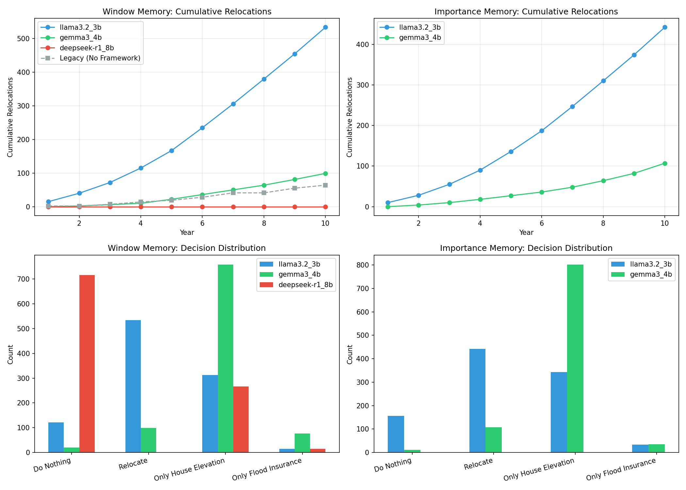

# Memory Benchmark Analysis Report | 記憶體基準分析報告

## Executive Summary | 執行摘要

This report presents the results of comparing **Window Memory** vs **Importance Memory** systems across multiple LLM models, with the legacy (no-framework) baseline.

本報告呈現 **Window Memory（窗口記憶）** 與 **Importance Memory（重要性記憶）** 系統在多個 LLM 模型中的比較結果，以及與傳統（無框架）基線的對照。

---

## 1. Validation Rules Summary | 驗證規則摘要

| Model/Engine           | Total Decisions | Retries | Retry Rate | Validation Failed | Parse Warnings | Failed Rules     |
| ---------------------- | --------------- | ------- | ---------- | ----------------- | -------------- | ---------------- |
| window_llama3_2_3b     | 1000            | 0       | 0.0%       | 0                 | 1000           | None             |
| window_gemma3_4b       | 1000            | 0       | 0.0%       | 0                 | 977            | None             |
| window_deepseek_r1_8b  | 1000            | 0       | 0.0%       | 0                 | 999            | None             |
| importance_llama3_2_3b | 1000            | 1       | 0.1%       | 1                 | 999            | urgency_check: 1 |
| importance_gemma3_4b   | 1000            | 0       | 0.0%       | 0                 | 978            | None             |

### Key Observations | 關鍵觀察

- **Zero Validation Failures**: All models achieved near-perfect validation compliance (0-0.1% failure rate).
- **Parse Warnings**: These are informational and do not block decisions.
- **Single Rule Trigger**: Only the `urgency_check` rule was triggered once in the entire benchmark.

- **零驗證失敗**：所有模型的驗證合規率接近完美（0-0.1%失敗率）。
- **解析警告**：這些是資訊性的，不會阻止決策。
- **單一規則觸發**：在整個基準測試中，僅 `urgency_check` 規則被觸發一次。

---

## 2. Behavioral Differences | 行為差異表

| Scenario                | Total Agents | Cumulative Relocations | Do Nothing | Relocate | House Elevation | Flood Insurance |
| ----------------------- | ------------ | ---------------------- | ---------- | -------- | --------------- | --------------- |
| window_llama3.2_3b      | 100          | 534                    | 121        | 534      | 313             | 15              |
| window_gemma3_4b        | 100          | 99                     | 20         | 99       | 759             | 77              |
| window_deepseek-r1_8b   | 100          | 0                      | 716        | 0        | 267             | 14              |
| importance_llama3.2_3b  | 100          | 442                    | 156        | 442      | 343             | 34              |
| importance_gemma3_4b    | 100          | 107                    | 11         | 107      | 802             | 35              |
| **legacy_no_framework** | **100**      | **64**                 | **433**    | **64**   | **184**         | **52**          |

### Key Observations | 關鍵觀察

1. **Llama 3.2 is highly sensitive**: Both Window and Importance memory show very high relocation rates (534 and 442 cumulative occurrences).
2. **DeepSeek-R1 is conservative**: Zero relocations with Window memory, with 716 "Do Nothing" decisions.
3. **Gemma 3 is balanced**: Moderate relocation rates (99-107) with strongest preference for House Elevation (759-802).
4. **Legacy Baseline**: Only 64 relocations with 433 "Do Nothing" decisions, showing high inertia.

5. **Llama 3.2 高度敏感**：Window 和 Importance 記憶都顯示非常高的搬遷率（分別為 534 和 442 次累計發生）。
6. **DeepSeek-R1 保守**：Window 記憶下零搬遷，有 716 次「不採取行動」決策。
7. **Gemma 3 平衡**：中等搬遷率（99-107），最偏好房屋加高（759-802）。
8. **傳統基線**：僅 64 次搬遷，433 次「不採取行動」決策，顯示高惰性。

---

## 3. Memory Window vs Legacy Analysis | 記憶窗口與傳統對比分析

### The "Amnesia" Question | 「失憶」問題

**Q: Did the memory window issue exist in the legacy logs?**
**A: Yes.** Both the legacy and current systems use a memory window of 3, which causes similar truncation of flood history.

**問：記憶窗口問題在傳統日誌中是否存在？**
**答：是的。** 傳統和當前系統都使用記憶窗口為 3，這會導致類似的洪水歷史截斷。

### Why Legacy Agents Were More Conservative | 為何傳統代理更保守

| Factor                   | Legacy (No Framework)           | Current (Governed)        |
| ------------------------ | ------------------------------- | ------------------------- |
| High Threat → Do Nothing | **47%** allowed                 | **Blocked** by governance |
| Low Coping → Take Action | 50% inconsistent                | **Blocked** by governance |
| Trust in Neighbors       | Increased over time (0.42→0.62) | Same trend                |
| Trust in Insurance       | Decayed over time (0.33→0.27)   | Same trend                |

The governed framework **enforces logical consistency**: agents with "High Threat" appraisal must take action, while agents with "Low Coping" cannot take action. This removes the "lazy ignorance" that existed in the legacy system.

治理框架**強制邏輯一致性**：「高威脅」評估的代理必須採取行動，而「低應對能力」的代理不能採取行動。這消除了傳統系統中存在的「懶惰無知」。

---

## 4. Comparison Plots | 比較圖表

_Top Left_: Window Memory cumulative relocations over 10 years
_Top Right_: Importance Memory cumulative relocations over 10 years
_Bottom Left_: Window Memory decision distribution by model
_Bottom Right_: Importance Memory decision distribution by model

_左上_：Window Memory 10 年累計搬遷量
_右上_：Importance Memory 10 年累計搬遷量
_左下_：Window Memory 各模型決策分佈
_右下_：Importance Memory 各模型決策分佈

---

## 5. Next Steps | 下一步計劃

1. **Complete DeepSeek Importance Memory Run**: Currently in progress.
2. **Add GPT-OSS Model**: Include the fourth model for comprehensive comparison.
3. **Generate Publication-Ready Figures**: High-resolution plots with consistent styling.
4. **Statistical Analysis**: Perform chi-square tests on decision distributions.

5. **完成 DeepSeek Importance Memory 運行**：目前進行中。
6. **添加 GPT-OSS 模型**：包含第四個模型以進行全面比較。
7. **生成可發表圖表**：高解析度圖表，風格一致。
8. **統計分析**：對決策分佈進行卡方檢驗。

---

_Generated by `analyze_benchmark_results.py` | 由 `analyze_benchmark_results.py` 生成_
