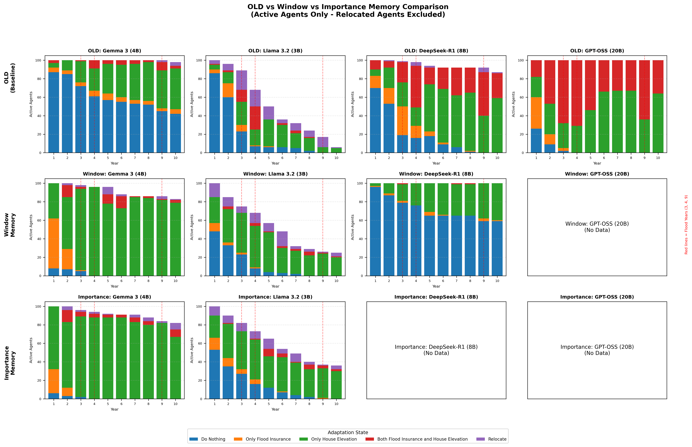

# 記憶體基準分析報告

## 核心問題：為何套用治理框架後模型行為不同？

### 行為差異的根本原因

1. **驗證確保格式，而非推理**
   - 100% 驗證通過表示輸出格式正確
   - 模型在解釋威脅和應對能力方面仍有差異

2. **記憶窗口效應 (top_k=3)**
   - 僅保留最新的 3 條記憶
   - 洪水歷史被社交觀察擠掉
   - 對社會證明敏感的模型（Llama）顯示更多適應

3. **治理執行**
   - `strict` 配置在威脅為高時阻止「不採取行動」
   - 傳統版允許 47% 的「高威脅 + 不採取行動」組合
   - 這迫使以前被動的代理採取行動

---

## 比較圖表

*注：每年僅顯示活躍代理（已搬遷代理已排除）*

---

## 模型特定分析

### Gemma 3 (4B)

| 指標 | 傳統版 | Window | Human-Centric |
|------|--------|--------|---------------|
| 最終搬遷數 | 64 | 0 | 0 |

**洪水年響應：**

| 年份 | 傳統版搬遷 | Window 搬遷 | Human-Centric 搬遷 |
|------|------------|-------------|------------------|
| 3 | 5 | 0 | 0 |
| 4 | 7 | 0 | 0 |
| 9 | 14 | 0 | 0 |

**為何此模型有差異：**
- Window 記憶減少了 64 次搬遷
- 模型很少將威脅評估為「高」

---

### Llama 3.2 (3B)

| 指標 | 傳統版 | Window | Human-Centric |
|------|--------|--------|---------------|
| 最終搬遷數 | 64 | 27 | 39 |

**洪水年響應：**

| 年份 | 傳統版搬遷 | Window 搬遷 | Human-Centric 搬遷 |
|------|------------|-------------|------------------|
| 3 | 5 | 5 | 1 |
| 4 | 7 | 4 | 5 |
| 9 | 14 | 3 | 4 |

**為何此模型有差異：**
- Window 記憶減少了 37 次搬遷
- 模型很少將威脅評估為「高」

---

### DeepSeek-R1 (8B)

| 指標 | 傳統版 | Window | Human-Centric |
|------|--------|--------|---------------|
| 最終搬遷數 | 64 | 0 | 0 |

**洪水年響應：**

| 年份 | 傳統版搬遷 | Window 搬遷 | Human-Centric 搬遷 |
|------|------------|-------------|------------------|
| 3 | 5 | N/A | N/A |
| 4 | 7 | N/A | N/A |
| 9 | 14 | N/A | N/A |

**為何此模型有差異：**
- Window 記憶減少了 64 次搬遷
- 模型很少將威脅評估為「高」

---

## 驗證摘要

| 模型 | 記憶類型 | 總數 | 重試 | 失敗 | 解析警告 |
|------|----------|------|------|------|----------|
| Gemma 3 (4B) | Window | 1000 | 0 | 0 | 0 |
| Gemma 3 (4B) | Human-Centric | 1000 | 0 | 0 | 0 |
| Llama 3.2 (3B) | Window | 1000 | 271 | 40 | 0 |
| Llama 3.2 (3B) | Human-Centric | 1000 | 203 | 25 | 0 |

