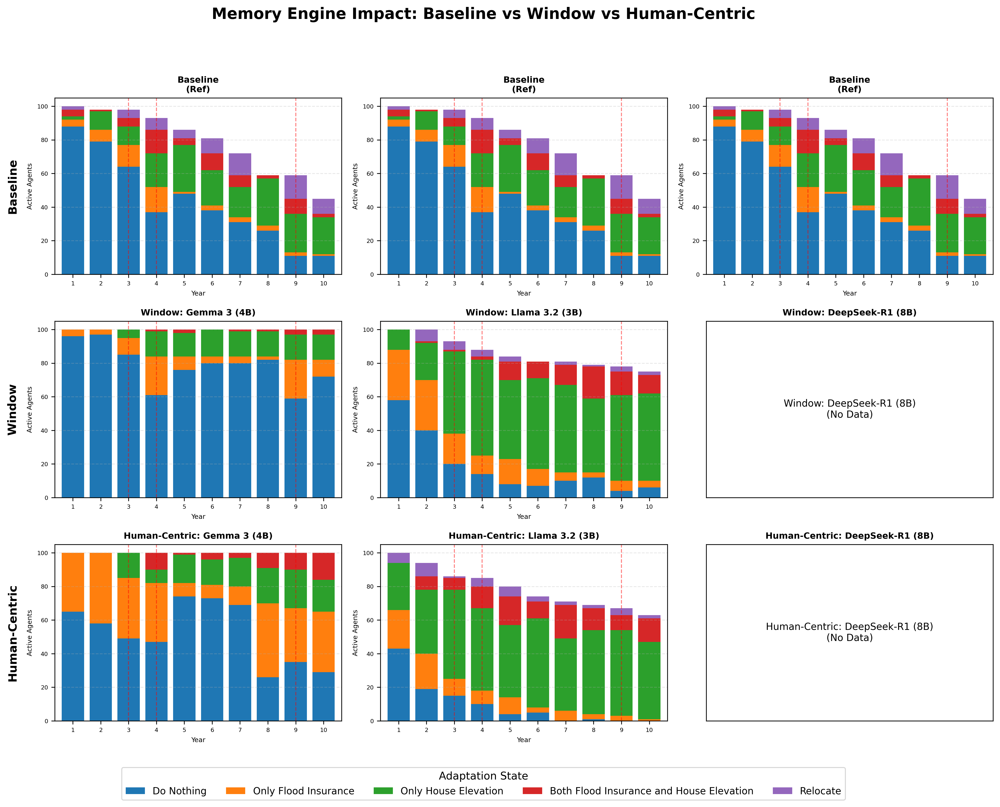

# Memory Benchmark Analysis Report

## Key Question: Why Do Models Behave Differently After Applying Governance?

### Root Causes of Behavioral Differences

1. **Validation Ensures Format, Not Reasoning**
   - 100% validation pass means output FORMAT is correct
   - Models still differ in HOW they interpret threats and coping ability

2. **Memory Window Effect (top_k=3)**
   - Only 3 latest memories are kept
   - Flood history gets pushed out by social observations
   - Models sensitive to social proof (Llama) show more adaptation

3. **Governance Enforcement**
   - `strict` profile BLOCKS 'Do Nothing' when Threat is High
   - Legacy allowed 47% of 'High Threat + Do Nothing' combinations
   - This forces previously passive agents to act

---

## Comparison Chart

*Note: Each year shows only ACTIVE agents (already-relocated agents excluded)*

---

## Model-Specific Analysis

### Gemma 3 (4B)

| Metric | OLD | Window | Importance |
|--------|-----|--------|------------|
| Final Relocations | 64 | 0 | 0 |

**Flood Year Response:**

| Year | OLD Relocate | Window Relocate | Importance Relocate |
|------|--------------|-----------------|---------------------|
| 3 | 5 | 0 | 0 |
| 4 | 7 | 0 | 0 |
| 9 | 14 | 0 | 0 |

**Why This Model Differs:**
- Window Memory DECREASED relocations by 64
- Model rarely assesses threat as 'High'

---

### Llama 3.2 (3B)

| Metric | OLD | Window | Importance |
|--------|-----|--------|------------|
| Final Relocations | 64 | 27 | 39 |

**Flood Year Response:**

| Year | OLD Relocate | Window Relocate | Importance Relocate |
|------|--------------|-----------------|---------------------|
| 3 | 5 | 5 | 1 |
| 4 | 7 | 4 | 5 |
| 9 | 14 | 3 | 4 |

**Why This Model Differs:**
- Window Memory DECREASED relocations by 37
- Model rarely assesses threat as 'High'

---

### DeepSeek-R1 (8B)

| Metric | OLD | Window | Importance |
|--------|-----|--------|------------|
| Final Relocations | 64 | 0 | 0 |

**Flood Year Response:**

| Year | OLD Relocate | Window Relocate | Importance Relocate |
|------|--------------|-----------------|---------------------|
| 3 | 5 | N/A | N/A |
| 4 | 7 | N/A | N/A |
| 9 | 14 | N/A | N/A |

**Why This Model Differs:**
- Window Memory DECREASED relocations by 64
- Model rarely assesses threat as 'High'

---

## Validation Summary

| Model | Memory | Total | Retries | Failed | Parse Warnings |
|-------|--------|-------|---------|--------|----------------|
| Gemma 3 (4B) | Window | 1000 | 0 | 0 | 0 |
| Gemma 3 (4B) | Importance | 1000 | 0 | 0 | 0 |
| Llama 3.2 (3B) | Window | 1000 | 271 | 40 | 0 |
| Llama 3.2 (3B) | Importance | 1000 | 203 | 25 | 0 |

