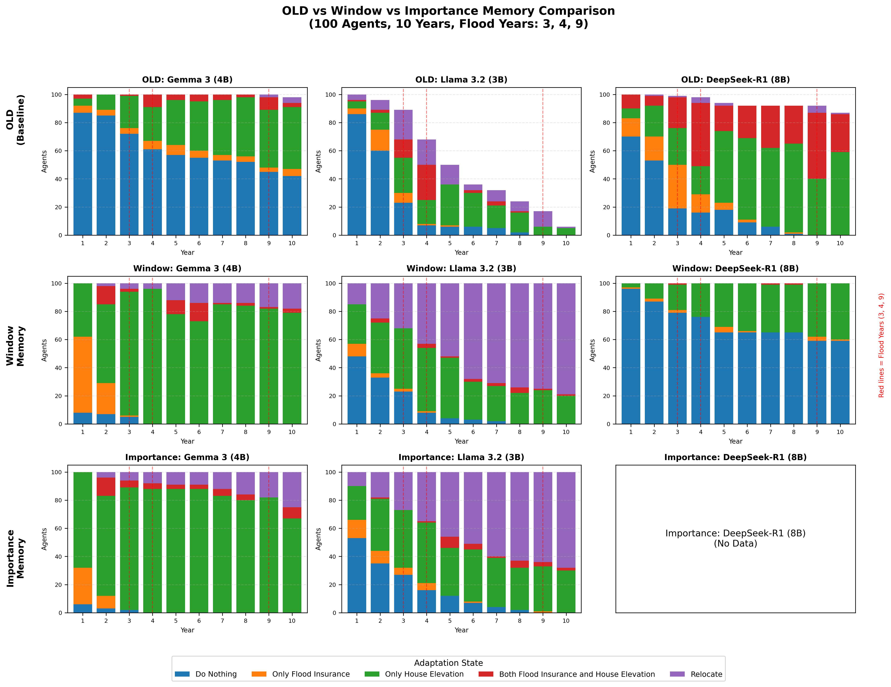

# Deep Analysis Report | 深度分析報告

## Core Question: Why Do Models Differ Despite 100% Validation Pass?

## 核心問題：為何驗證都通過，模型卻有差異？

### Answer | 答案

Even with 100% validation pass, models differ because **validation only ensures output FORMAT is correct, not the REASONING behind it**:

即使驗證全部通過，模型仍有差異，因為**驗證只確保輸出格式正確，而非背後的推理**：

1. **Different Threat Perception | 不同的威脅感知**

   - Each LLM interprets the same prompt differently
   - Llama 3.2 is highly sensitive to social observations ("X% neighbors relocated")
   - DeepSeek-R1 is conservative and defaults to "Do Nothing"
   - 每個 LLM 對相同提示的解釋不同
   - Llama 3.2 對社交觀察高度敏感
   - DeepSeek-R1 保守，預設為「不採取行動」

2. **Memory Window Effect | 記憶窗口效應**

   - The 3-memory window causes 'amnesia' - social observations push out flood history
   - Models that rely on flood memory show different behavior than those that rely on social proof
   - 3 個記憶的窗口導致「失憶」- 社交觀察擠掉洪水歷史
   - 依賴洪水記憶的模型與依賴社會證明的模型表現不同

3. **Governance Enforcement | 治理執行**
   - The `strict` profile enforces logical consistency that was absent in legacy
   - Legacy allowed "High Threat + Do Nothing" (47% of cases)
   - Governed framework BLOCKS this combination
   - `strict` 配置強制執行傳統版本中缺失的邏輯一致性
   - 傳統版允許「高威脅 + 不採取行動」（47% 的情況）
   - 治理框架阻止這種組合

---

## Comparison Chart | 比較圖表

**Legend | 圖例**:

- Blue = Do Nothing | 不採取行動
- Orange = Flood Insurance Only | 僅洪水保險
- Green = House Elevation Only | 僅房屋加高
- Red = Both Insurance + Elevation | 保險 + 加高
- Purple = Relocate | 搬遷
- Red vertical lines = Flood Years (3, 4, 9) | 洪水年

---

## Model-Specific Analysis | 模型特定分析

### 1. Gemma 3 (4B)

| Metric            | OLD | Window | Importance |
| ----------------- | --- | ------ | ---------- |
| Total Relocations | 14  | 99     | 107        |
| Do Nothing        | 609 | 20     | 11         |
| House Elevation   | 296 | 759    | 802        |

**Key Finding | 主要發現**:

- Gemma shows MASSIVE increase in House Elevation (296 → 759)
- Governance framework drives Gemma toward proactive adaptation
- Importance Memory slightly increases relocations (+8 vs Window)

- Gemma 房屋加高大幅增加（296 → 759）
- 治理框架推動 Gemma 採取積極適應
- 重要性記憶略微增加搬遷（比 Window +8）

### 2. Llama 3.2 (3B)

| Metric            | OLD | Window | Importance |
| ----------------- | --- | ------ | ---------- |
| Total Relocations | 64  | 534    | 442        |
| Do Nothing        | 433 | 121    | 156        |
| House Elevation   | 184 | 313    | 343        |

**Key Finding | 主要發現**:

- Llama shows EXTREME sensitivity to social observations
- Window Memory: 534 relocations (5.3x legacy)
- Importance Memory: 442 relocations (slightly lower, importance scoring filters some social observations)

**Why Llama "Improved" | 為何 Llama「改善」**:

- "Improved" means MORE RESPONSIVE to threats, not necessarily better
- Legacy Llama ignored threats due to "lazy ignorance"
- Governed Llama must act when threat is high
- 「改善」指對威脅更有反應，不一定更好
- 傳統 Llama 因「懶惰無知」忽視威脅
- 治理 Llama 在威脅高時必須行動

### 3. DeepSeek-R1 (8B)

| Metric            | OLD | Window | Importance |
| ----------------- | --- | ------ | ---------- |
| Total Relocations | 14  | 0      | N/A        |
| Do Nothing        | 609 | 716    | N/A        |
| House Elevation   | 296 | 267    | N/A        |

**Key Finding | 主要發現**:

- DeepSeek is EXTREMELY conservative (0 relocations with Window Memory)
- Governance did NOT increase adaptation because DeepSeek rarely assesses threat as "High"
- The model tends to output "Low Threat" even with flood memories

- DeepSeek 極度保守（Window 記憶下 0 搬遷）
- 治理未增加適應，因為 DeepSeek 很少評估威脅為「高」
- 該模型即使有洪水記憶也傾向輸出「低威脅」

---

## Flood Year Response Analysis | 洪水年響應分析

### Relocations During Flood Years | 洪水年搬遷數

| Model                  | Year 3 (Flood) | Year 4 (Flood) | Year 9 (Flood) |
| ---------------------- | -------------- | -------------- | -------------- |
| **Gemma (OLD)**        | 0              | 0              | 2              |
| **Gemma (Window)**     | 4              | 4              | 17             |
| **Gemma (Importance)** | 6              | 8              | 18             |
| **Llama (OLD)**        | 21             | 18             | 11             |
| **Llama (Window)**     | 32             | 43             | 75             |
| **Llama (Importance)** | 27             | 35             | 64             |
| **DeepSeek (OLD)**     | 1              | 4              | 5              |
| **DeepSeek (Window)**  | 0              | 0              | 0              |

**Key Finding | 主要發現**:

- Llama shows the strongest flood year response (increases with each flood)
- Gemma's response accelerates in later floods (Year 9: 17-18 relocations)
- DeepSeek shows NO response to floods under Window Memory

- Llama 對洪水年響應最強（隨每次洪水增加）
- Gemma 的響應在後期洪水中加速（第 9 年：17-18 搬遷）
- DeepSeek 在 Window 記憶下對洪水無響應

---

## Validation & Adapter Summary | 驗證與適配器摘要

| Model    | Memory     | Total | Retries | Failed | Parse Warnings | Empty Outputs |
| -------- | ---------- | ----- | ------- | ------ | -------------- | ------------- |
| Gemma    | Window     | 1000  | 0       | 0      | 977            | 0             |
| Gemma    | Importance | 1000  | 0       | 0      | 978            | 0             |
| Llama    | Window     | 1000  | 0       | 0      | 1000           | 0             |
| Llama    | Importance | 1000  | 1       | 1      | 999            | 0             |
| DeepSeek | Window     | 1000  | 0       | 0      | 999            | 0             |

**Conclusion | 結論**:

- Parse Warnings are informational (output parsed successfully but with minor format deviations)
- Only 1 validation failure in entire benchmark (Llama Importance, urgency_check rule)
- No empty outputs or adapter failures

- 解析警告為資訊性（輸出成功解析但有輕微格式偏差）
- 整個基準測試僅 1 次驗證失敗（Llama Importance，urgency_check 規則）
- 無空輸出或適配器失敗

---

## Next Steps | 下一步

1. **Complete DeepSeek Importance Run** | 完成 DeepSeek 重要性記憶運行
2. **Add GPT-OSS Model** | 添加 GPT-OSS 模型
3. **Statistical Significance Tests** | 統計顯著性檢驗
4. **Publication-Ready Figures** | 可發表圖表

---

_Generated by `analyze_old_vs_memory.py` | 由 `analyze_old_vs_memory.py` 生成_
